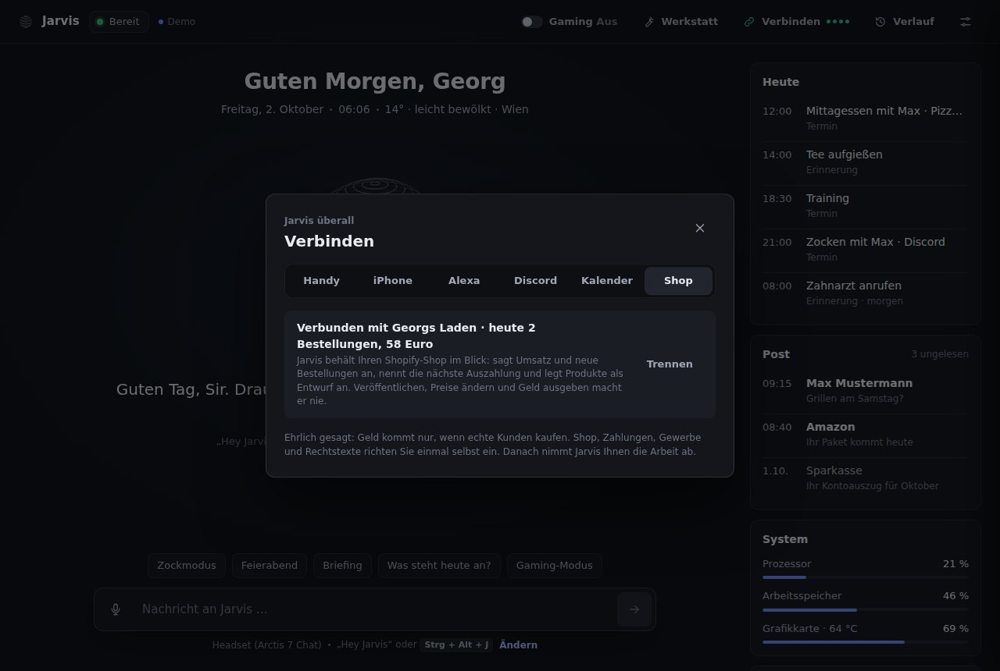

# Jarvis in 3 Schritten

Diese Anleitung ist für dich, Georg. Jarvis läuft danach unsichtbar im Hintergrund und ist immer da, wenn du „Hey Jarvis“ sagst. Er klappt auch auf einem ganz leeren PC: Der Installer holt alles, was fehlt, von selbst.

## 1. Installieren (5 Minuten)

1. Diese Datei laden: https://github.com/georghatzmann-bit/vanity-/releases/latest/download/JarvisSetup.exe
   Zeigt GitHub „Page not found“: erst oben rechts bei GitHub anmelden (das Projekt ist privat), dann den Link noch einmal öffnen.
2. Doppelklick auf `JarvisSetup.exe`. Fragt Windows nach („Der Computer wurde durch Windows geschützt“): **Weitere Informationen** > **Trotzdem ausführen**. Das kommt, weil der Installer nicht mit einem gekauften Zertifikat signiert ist.
3. Den Haken bei **„Jarvis mit Windows starten“** drin lassen und **Installieren** klicken.

Der Installer holt selbst: Python, die Spracherkennung, die Stimmen und Claude Code (Jarvis' Gehirn). Beim ersten Mal dauert das ein paar Minuten. Läuft noch ein älteres Jarvis, beendet der Installer es selbst und startet danach das neue. Fehlt auf einem ganz frischen PC eine Microsoft-Laufzeit, fragt Windows einmal nach Administratorrechten: **Ja** klicken.

**Geklappt, wenn:** sich am Ende die Einrichtung von selbst öffnet. Deine Einstellungen von vorher bleiben erhalten.

## 2. Einrichtung durchklicken (2 Minuten)

Die Einrichtung führt dich in sieben kurzen Schritten durch. Jeder Schritt wird sofort gespeichert. Später kommst du wieder hin: Rechtsklick aufs Jarvis-Symbol neben der Uhr > **Einstellungen**, oder das Zahnrad im Jarvis-Fenster.

1. **Mikrofon:** dein Mikrofon anklicken und „Hey Jarvis“ sagen. Darunter den **Groq-Schlüssel** einfügen (siehe unten) und **Prüfen** klicken. Es klappt, wenn „Aktiv“ erscheint.
2. **Stimme:** **Premium** wählen, den **ElevenLabs-Schlüssel** einfügen (siehe unten), **Prüfen**, Stimmen anhören und eine anklicken. Ohne Schlüssel spricht die kostenlose Microsoft-Stimme.
3. **Name und Ort:** dein Vorname (damit Jarvis weiß, mit wem er spricht) und dein Wohnort für das Wetter.
4. **Gehirn:** **Bei Claude anmelden** klicken. Im schwarzen Fenster Enter drücken, bis sich der Browser öffnet (fragt es nach der Anmeldeart: die erste nehmen, „Claude account with subscription“). Im Browser mit deinem Claude-Konto anmelden. Dann das schwarze Fenster schließen und **Nochmal prüfen** klicken. Es klappt, wenn „Claude ist verbunden“ erscheint. Dafür reicht dein Claude-Abo (Pro oder Max).
5. **Extras:** Stumm-Taste, Autostart und **Volle Freigabe** (siehe unten). Einfach so lassen, wie es ist.
6. **Jarvis starten.**

### Gratis-Schlüssel für die Spracherkennung (Groq)

Damit versteht Jarvis dich viel besser und schneller. Kostet nichts.

1. https://console.groq.com/keys öffnen und mit Google anmelden.
2. **Create API Key** klicken, einen Namen eingeben (zum Beispiel „Jarvis“), **Submit**.
3. Den Schlüssel (beginnt mit `gsk_`) kopieren. Er wird nur einmal angezeigt.

Optional: Soll **„Jarvis“ allein** reichen (ohne „Hey“)? Dann in der Einrichtung bei Mikrofon auf **Picovoice öffnen** klicken, gratis Konto anlegen, den **AccessKey** einfügen und **Prüfen** klicken.

### Premium-Stimme (ElevenLabs, gratis möglich)

Das ist der große Unterschied: Jarvis klingt dann wie ein Mensch.

1. https://elevenlabs.io öffnen und ein Konto anlegen.
2. https://elevenlabs.io/app/settings/api-keys öffnen > **Create API Key** > Namen eingeben > ohne Einschränkungen erstellen.
3. Den Schlüssel (beginnt mit `sk_`) kopieren.

**Welche Stimmen gehen gratis?** Das Gratis-Konto hat 10.000 Credits im Monat, das sind etwa 150 bis 300 kurze Antworten. Fertige Stimmen gibt ElevenLabs damit aber meist nicht an Programme wie Jarvis heraus. Kostenlos geht immer eine Stimme, die du **selbst entwirfst**:

1. Auf elevenlabs.io links **Voices** > **My Voices** > **Add a new voice** > **Voice Design**.
2. Als Beschreibung einfügen (die Einrichtung hat dafür einen Kopieren-Knopf):
   `Perfect audio quality. Middle-aged British man, calm, deep and warm voice, refined and polite like a loyal butler, dry wit, measured pace, speaks fluent German with a slight British accent.`
3. Als Text einfügen:
   `Guten Abend, Sir. Ich habe alle Systeme überprüft, es läuft alles einwandfrei. Ihr Kaffee ist in fünf Minuten fertig, und das Wetter bleibt bis morgen freundlich.`
4. **Generate** klicken, die drei Vorschläge anhören und den besten speichern, zum Beispiel als „Jarvis“.

Fertige Stimmen aus der Bibliothek (zum Beispiel Lennard) gehen ab dem Abo **Starter** (etwa 6 $ im Monat).

### Lokale Stimme (kostenlos, ohne Internet)

Die Alternative zu ElevenLabs: Eine natürliche deutsche Stimme, die ganz auf deinem PC läuft. Kein Abo, kein Schlüssel, nichts geht ins Internet.

1. Einrichtung (Zahnrad im Jarvis-Fenster) > **Stimme** > Reiter **Lokal**.
2. **Lokal einrichten** klicken. Jarvis lädt einmalig etwa 1,3 GB (Stimme und Spracherkennung). Das dauert je nach Internet 5 bis 15 Minuten.
3. Die sechs Stimmen anhören (▶) und eine anklicken. **George** ist am klarsten, **Charles** am tiefsten.
4. Wer möchte: **Auch die Spracherkennung auf dem PC** einschalten. Dann geht außer den Fragen an Claude gar nichts mehr ins Internet.

**Geklappt, wenn:** oben „Aktiv“ steht und Jarvis mit der gewählten Stimme antwortet. Die Stimme rechnet auf dem Prozessor und nimmt höchstens die Hälfte der Kerne, damit Spiele flüssig bleiben.

## 3. Handy, Alexa, Discord, Kalender und Shop verbinden (freiwillig)

Im Jarvis-Fenster oben auf **Verbinden** klicken. Dort gibt es die Bereiche Handy, Alexa, Discord, Kalender und Shop.

### Handy

1. Bereich **Handy**: den Schalter einschalten. Fragt Windows nach der Firewall: **Zulassen**.
2. Mit der Handy-Kamera den QR-Code scannen und den Link öffnen.
3. Im Browser-Menü **Zum Startbildschirm hinzufügen** (iPhone: Teilen-Knopf). Jetzt ist Jarvis eine App auf deinem Handy.

**Geklappt, wenn:** oben in der App „Bereit“ steht. Du kannst schreiben, mit dem Mikrofon der Handy-Tastatur diktieren, Schnellaktionen (auch deine eigenen Befehle) antippen und die Werkstatt verfolgen. Das Handy muss im selben WLAN sein.

**Jarvis' Stimme auf dem Handy:** Oben rechts in der App steht, wo Jarvis antwortet. Tippen wechselt zwischen **Handy** (Jarvis spricht auf dem Handy, in derselben Stimme wie am PC), **PC** und **Still**.

**Sicher von überall, mit Sprechtaste:** Mit **Tailscale** (kostenlos) geht die App auch unterwegs, über eine verschlüsselte Adresse. Dann funktioniert auch die **Sprechtaste** in der App (antippen, sprechen, nochmal tippen), und die App lässt sich richtig installieren.

1. Tailscale auf dem PC installieren (oder sag „Jarvis, installiere Tailscale“) und einmal anmelden (Symbol unten rechts neben der Uhr).
2. Auf dem Handy die App **Tailscale** installieren und mit demselben Konto anmelden.
3. Im Bereich **Handy** bei **Sicher von überall** auf **Einschalten** klicken. Kommt der Knopf **HTTPS erlauben**: anklicken, im Browser bestätigen, dann nochmal **Einschalten**.
4. Den QR-Code neu scannen. Die Adresse beginnt jetzt mit `https://`.

**Benachrichtigungen aufs Handy** (Erinnerungen, „Aus der Werkstatt: fertig“), wenn du nicht am PC sitzt:

1. Im selben Bereich **Benachrichtigungen** einschalten.
2. Auf dem Handy die kostenlose App **ntfy** installieren.
3. In der App auf **+** tippen und den Kanalnamen eintragen, den Jarvis anzeigt (beginnt mit `jarvis-`).
4. In Jarvis auf **Test schicken** klicken. Auf dem Handy erscheint sofort eine Nachricht.

### Alexa

„Alexa, sag Jarvis, er soll Discord öffnen.“ Dafür legst du einmal deinen eigenen Alexa-Skill an. Der gehört nur dir. Home Assistant brauchst du dafür nicht.

1. Bereich **Alexa**: den Schalter einschalten.
2. **Öffnen** klicken und mit dem Amazon-Konto anmelden, mit dem dein Echo läuft.
3. **Skill erstellen**: Name „Jarvis“, Sprache Deutsch, Modell „Benutzerdefiniert“, Hosting „Von Alexa gehostet (Python)“, Vorlage „Von Grund auf neu“.
4. In Jarvis bei „Sprachmodell“ **Kopieren** klicken. In der Konsole links **Interaktionsmodell** > **JSON-Editor**: alles ersetzen, **Modell speichern**, **Modell erstellen**.
5. In Jarvis bei „Code“ **Kopieren** klicken. In der Konsole oben **Code**, Datei `lambda_function.py`: alles ersetzen, **Speichern**, **Bereitstellen**.
6. In der Konsole oben **Test**: „Entwicklung“ wählen.

**Geklappt, wenn:** „Alexa, sag Jarvis, er soll Spotify öffnen“ Spotify am PC öffnet. Dauert etwas länger als sechs Sekunden, sagt Alexa „Ich kümmere mich darum“, und Jarvis macht trotzdem weiter. Fragt Jarvis zurück („Gute Nacht, Sir. Soll ich den PC herunterfahren?“), hört Alexa weiter zu: einfach „Ja“ sagen.

### Discord-Bot

Jarvis' eigener Bot gestaltet deinen Server im Hintergrund: Kanäle, Rollen, Regeln, Begrüßung. Ohne Maus, während du zockst.

1. Bereich **Discord**: **Öffnen** klicken, mit deinem Discord-Konto anmelden, **New Application**, Name „Jarvis“, **Create**.
2. Links **Bot** > **Reset Token** > Token kopieren.
3. In Jarvis den Token einfügen und **Prüfen** klicken.
4. **Einladen** klicken, deinen Server auswählen, **Autorisieren**.

**Geklappt, wenn:** du sagst „Jarvis, gestalte meinen Discord-Server für Gaming mit Regeln und Sprachkanälen“ und die Kanäle erscheinen.

### Kalender

Jarvis liest deinen Kalender mit (nur lesen): Er sagt 15 Minuten vor einem Termin Bescheid, nennt die Termine morgens, zeigt sie rechts bei **Heute** und merkt, wenn ein Termin abgesagt oder verschoben wird. Eigene Termine („Trag morgen um 18 Uhr Training ein“) gehen auch ganz ohne.

1. Bereich **Kalender**: Bei **Google** oder **Outlook** auf **Öffnen** klicken.
   - Google: links deinen Kalender wählen, ganz unten **Privatadresse im iCal-Format** kopieren.
   - Outlook: **Kalender veröffentlichen**, dann den **ICS**-Link kopieren.
   - iPhone: Kalender-App > Kalender > (i) > **Öffentlicher Kalender** > Link teilen.
2. Die Adresse in Jarvis einfügen und **Prüfen** klicken.

**Geklappt, wenn:** Jarvis „Kalender verbunden: … Termine“ meldet. Die Adresse ist geheim wie ein Passwort.

### Shop (Shopify)

Hast du einen Shopify-Shop, behält Jarvis ihn im Blick: **„Wie läuft der Shop?“** nennt Bestellungen und Umsatz von heute und dieser Woche, **„Wann kommt die nächste Auszahlung?“** das Geld von Shopify. Neue Bestellungen sagt er an (beim Zocken nur aufs Handy). Auf Wunsch legt er Produkte als **Entwurf** an („Leg im Shop ein Mauspad mit Jarvis-Logo für 19,90 an“). Veröffentlichen, Preise im Laden ändern, Geld ausgeben und Kunden schreiben macht er **nie**, das bleibt dein Klick.

1. Bereich **Shop**: **Öffnen** klicken. Im Shopify-Admin: **Einstellungen** > **Apps** > **Apps entwickeln** > **Apps im Dev Dashboard erstellen**. Dann **App erstellen**, Name „Jarvis“.
2. Unter **Zugriff** > **Bereiche** genau diese vier eintragen (der Knopf **Kopieren** hilft): `read_orders, read_products, write_products, read_shopify_payments_payouts`. Dann **Veröffentlichen**.
3. **Installationen** > **App installieren** > deinen Shop wählen.
4. **Einstellungen** > **Anmeldedaten**: Client-ID und Client-Secret kopieren, im Jarvis-Fenster mit der Shop-Adresse (`meinladen.myshopify.com`) einfügen, **Prüfen und verbinden**.

**Geklappt, wenn:** „Verbunden mit …“ erscheint und rechts im Fenster die Shop-Karte mit Umsatz auftaucht. Das Secret speichert Jarvis verschlüsselt nur auf diesem PC.

**Ehrlich gesagt:** Geld kommt nur, wenn echte Kunden kaufen. Niemand kann Einnahmen garantieren. Shop, Shopify Payments (ab 18, mit Ausweis und Konto), in Österreich ein Gewerbe, Impressum, Datenschutz und seit 1.10.2026 ein Widerrufsbutton im Shop richtest du einmal selbst ein. Danach nimmt Jarvis dir die Arbeit ab.

### PC per Handy einschalten (Wake-on-LAN)

1. Bereich **Handy**: auf **PC fürs Einschalten per Netzwerk vorbereiten** klicken und bei Windows **Ja** sagen.
2. Auf dem Handy eine App wie **„Wake On Lan“** installieren und die MAC-Adresse und IP-Adresse eintragen, die Jarvis dort anzeigt.

Das geht nur, wenn der PC per Kabel am Router hängt und ausgeschaltet (nicht stromlos) ist. Bei manchen PCs muss „Wake on LAN“ zusätzlich im BIOS eingeschaltet werden.

## So benutzt du Jarvis

- **„Hey Jarvis“** sagen (englisch ausgesprochen), kurz warten, Befehl auf Deutsch sprechen. Mit Picovoice-Schlüssel reicht **„Jarvis“**.
- Oder **Strg + Alt + J** drücken: Jarvis hört sofort zu.
- Beim Weckwort erscheint **das Jarvis-Fenster** ganz vorn, ohne dir die Tastatur wegzunehmen. 6 Sekunden nach dem Gespräch verschwindet es wieder. Beim Spielen (Vollbild, Gaming-Modus) bleibt es weg.
- **Das Fenster:** In der Mitte Jarvis' Kugel. Sie leuchtet heller, wenn er zuhört oder spricht, und wird grau, wenn das Mikrofon aus ist. Ein Klick auf die Kugel, und er hört sofort zu. Darunter das Gespräch und das Eingabefeld. Oben: **Gaming**-Schalter, **Werkstatt**, **Verbinden**, **Verlauf** und die Einstellungen. Rechts: was **heute** ansteht, wie ausgelastet der PC ist, und das **Gedächtnis**.
- **Minimieren oder Schließen** lässt Jarvis ganz verschwinden. Er hört trotzdem weiter zu. Beenden: Rechtsklick aufs Symbol neben der Uhr > Jarvis beenden.
- Unter der Antwort steht, **was Jarvis gerade tut** („Installiert Spotify“), mit einem Haken, wenn es fertig ist.
- **Strg + Alt + M** schaltet das Mikrofon stumm und wieder an.
- **„Stopp“** oder der Stopp-Knopf unterbricht Jarvis sofort, auch ein angekündigtes Herunterfahren.

## Was du sagen kannst

**Sofort, ohne Wartezeit** (meist unter einer Sekunde):

- „Was kannst du?“ (eine kurze Übersicht zum Einstieg)
- „Öffne Spotify“, „Starte Discord“, „Mach Steam zu“, „Öffne YouTube“, „Öffne den Ordner Downloads“
- „Geh auf Reddit“, „Such auf YouTube nach Katzenvideos“, „Google mal Pizza in der Nähe“, „Navigiere nach Graz“
- „Spiel Thunderstruck“ (das erste YouTube-Video läuft sofort), „Spiel Queen auf Spotify“
- „Dunkelmodus an“, „Bluetooth aus“, „WLAN an“, „Öffne die Bluetooth-Einstellungen“
- „Wie wird das Wetter morgen?“, „Was ist 15 mal 23?“, „Wie spät ist es?“
- „Lauter“, „Lautstärke 30“, „Mach Musik an“, „Nächstes Lied“, „Pausiere“
- „Minimiere alles“, „Mach einen Screenshot“ (landet unter Bilder > Screenshots), „Wie viel Speicher ist frei?“
- „Weck mich um 7“ (Jarvis sagt es an, und mit Benachrichtigungen kommt es auch aufs Handy)
- „Installier mir Spotify“ (Jarvis meldet sich, wenn es fertig ist)
- „Gaming-Modus an“, „Sperr den PC“, „Zeig dich“, „Versteck dich“
- „Erinnere mich in 20 Minuten an den Tee“, „Stell einen Timer auf 10 Minuten“
- Mehrere auf einmal: „Öffne Spotify und Discord“

**Discord und Chats** (ohne Maus, in ein, zwei Sekunden):

- „Schreib Max auf Discord, bin gleich da“, „Schick Anna über WhatsApp: Ich komme später“ (auch Telegram)
- „Sag Max, dass ich später anrufe“: Jarvis nimmt die App, über die du Max sonst schreibst, und schickt „Ich rufe später an“.
- „Schreib in den Kanal allgemein: bin gleich da“
- „Geh in den Sprachkanal Zocken“, „Öffne den Discord-Server Gilde“, „Geh in den Kanal memes“
- „Ruf Max an“ (über Discord), „Discord stumm“, „Discord taub“

**PC** (mit 15 Sekunden Vorlauf, „Stopp“ oder „Abbrechen“ hält es auf):

- „Fahr den PC herunter“, „Starte den PC neu“, „Energiesparmodus“, „Melde mich ab“
- „Gute Nacht“: Jarvis fragt, ob er den PC herunterfahren soll. „Ja“ genügt.

**Gedächtnis:**

- „Merk dir, dass ich gern Pizza esse“, „Merk dir: Max hat am 3. Mai Geburtstag“
- „Was weißt du über mich?“, „Vergiss das mit der Pizza“

**Eigene Befehle und Zeitpläne:**

- „Wenn ich Zockmodus sage, öffne Discord und Steam und mach den Gaming-Modus an“, danach reicht **„Zockmodus“**
- „Welche Befehle kennst du?“, „Lösch den Befehl Zockmodus“
- „Jeden Morgen um 8 Uhr: Briefing“, „Werktags um 18 Uhr öffne Discord“, „Freitags um 20 Uhr: Zockmodus“
- „Welche Zeitpläne habe ich?“, „Lösch den Zeitplan Briefing“

**Termine:**

- „Trag morgen um 18 Uhr Training ein“, „Trag Mittwoch von 18 bis 19 Uhr Sport ein“, „Trag am Sonntag Omas Geburtstag ein“
- „Was steht heute an?“, „Was habe ich morgen vor?“, „Wann ist mein nächster Termin?“
- „Sag den Termin Training ab“

**Notizbuch:**

- „Notiere: Milch kaufen“, „Schreib in mein Notizbuch, dass ich Max anrufen muss“
- „Öffne mein Notizbuch“, „Was haben wir gestern gemacht?“, „Recherchiere die besten Gaming-Mäuse“ (der Bericht landet im Notizbuch)

**Licht** (wenn Home Assistant eingerichtet ist, siehe ganz unten):

- „Mach das Licht im Wohnzimmer an“, „Dimm das Licht auf 30 Prozent“, „Licht aus“

**Mit Nachdenken** (ein paar Sekunden):

- „Was gibt es Neues?“, „Wann spielt Rapid heute?“, „Guten Morgen“
- „Was steht gerade auf meinem Bildschirm?“ (Jarvis liest den Text in etwa einer Sekunde)
- „Schreib Max auf Discord, dass ich später komme, und entschuldige dich“ (Jarvis formuliert selbst)
- „Gestalte meinen Discord-Server für Gaming mit Regeln und Sprachkanälen“ (mit Discord-Bot)

## Volle Freigabe

Jarvis macht alles, ohne nachzufragen: Programme installieren und deinstallieren, Dinge in den Papierkorb legen, Befehle mit Administratorrechten, Herunterfahren und Neustarten. Braucht etwas Administratorrechte, zeigt Windows die übliche Abfrage: einmal **Ja** klicken.

Nur zwei Dinge fragt er immer: bevor er **etwas kauft** und bevor er **in deinem Namen schreibt**, was du nicht selbst gesagt hast. Endgültig löschen (statt Papierkorb) und Laufwerke formatieren macht er nie.

Lieber vorher gefragt werden? Einstellungen > Extras > **Volle Freigabe** ausschalten.

## Gedächtnis: Jarvis lernt dich kennen

- Was du sagst („Merk dir, …“), behält Jarvis für immer.
- Er merkt sich, mit wem du über welche App schreibst. „Sag Max …“ nimmt dann die richtige App.
- Er sieht, was du ungefähr zur selben Zeit öffnest und in welchen Discord-Sprachkanal du gehst. Nach ein paar Tagen sagt er es zur passenden Zeit nebenbei, am Ende einer normalen Antwort: **„Es ist 18 Uhr, Sir. Übrigens: Um diese Zeit öffnen Sie meist Discord und gehen in den Sprachkanal Zocken. Soll ich?“** Antworte einfach mit **„Ja“**, **„Nein“** oder **„Nie wieder“** (ohne „Hey Jarvis“). Es gibt kein Fenster dafür. Beim Zocken fragt er nie.
- **Festplatte fast voll:** Sind auf einem Laufwerk weniger als 10 Gigabyte frei, erwähnt Jarvis es tagsüber in einer Antwort (höchstens alle drei Tage) und schaut auf „Ja“ nach, was am meisten Platz braucht.
- **Geburtstage:** Sag „Merk dir, Max hat am 3. Mai Geburtstag“. Am 3. Mai sagt Jarvis bei der nächsten Antwort: „Übrigens, Sir: Heute hat Max Geburtstag. Soll ich Max auf Discord gratulieren?“ Ein „Ja“, und die Glückwünsche sind raus. Sprichst du den ganzen Tag nicht mit ihm, sagt er es abends von selbst.
- Jede Nacht schaut er kurz auf die Gespräche vom Vortag und merkt sich, was wichtig war.
- Alles bleibt auf deinem PC. Im Fenster rechts bei **Gedächtnis** > **Ansehen** siehst du alles und kannst mit × einzelne Sachen löschen.

## Notizbuch und Fähigkeiten

**Notizbuch:** Jarvis schreibt jedes Gespräch mit Datum in einen Ordner (`%USERPROFILE%\Jarvis-Notizbuch`): ein Tagebuch pro Tag, eine Seite pro Person (mit Geburtstag und allem, was er über sie weiß), Berichte von Recherchen und deine Notizen. Mit dem kostenlosen Programm **Obsidian** („Ordner als Tresor öffnen“) siehst du alles verlinkt. Eigene Notizen in den Seiten bleiben erhalten. Passwörter schreibt er nie hinein.

**Fähigkeiten:** Für wiederkehrende Aufgaben hat Jarvis genaue Anleitungen, die er nur liest, wenn er sie braucht: Discord-Server gestalten, Morgen-Briefing, Recherche mit Bericht, PC aufräumen und aktualisieren, Spiele starten (auch Steam und Epic), Smart Home, Bildschirm lesen. Zeigst du ihm etwas Neues und sagst **„Lern das“**, schreibt er sich selbst eine neue Fähigkeit. Alle stehen unter **Gedächtnis** > **Ansehen**.

**Mit dem Claude-Max-Abo:** Einstellungen > **Gehirn** > **Gründlich**, dann denkt Jarvis immer mit Opus, dem klügsten Modell.

## Die Werkstatt: Jarvis programmiert für dich

Sag zum Beispiel **„Bau mir einen Discord-Bot, der jeden Morgen Hallo sagt“**, **„Programmier mir ein kleines Spiel“** oder **„Schreib mir ein Python-Skript, das meine Downloads sortiert“**.

1. Jarvis sagt „Ich gehe in die Werkstatt“ und das Fenster zeigt den Auftrag: links den Plan, in der Mitte jeden Schritt mit Dauer, rechts den Fortschritt als Ring und die Dateien.
2. Jarvis arbeitet im Hintergrund. Du kannst ihn währenddessen ganz normal fragen. **„Wie weit bist du?“** nennt den aktuellen Schritt.
3. Ist er fertig, sagt er es dir. **Ordner öffnen** zeigt das Projekt, `start.bat` startet es.

- **Große Aufträge** (Spiele, Apps mit Login, Shops) baut Jarvis mit dem klügsten Modell (Opus), kleine mit dem schnelleren (Sonnet).
- **Alle Projekte auf einen Blick:** oben im Fenster **Werkstatt**, oder „Zeig mir meine Projekte“. Jede Karte zeigt den Stand, **Starten** und **Weiterbauen**.
- **Weiter am selben Projekt:** „Arbeite am Discord-Bot weiter: füg einen Befehl hinzu“. Jarvis weiß noch, was er gebaut hat.
- „Starte das Projekt Würfelspiel“, „Öffne den Ordner vom Discord-Bot“
- Jedes Projekt hat einen eigenen Ordner unter `%USERPROFILE%\Jarvis-Werkstatt`.
- **Stopp** (zweimal klicken) oder **„Brich die Werkstatt ab“** beendet die Arbeit. Was schon gebaut ist, bleibt.

## Wenn etwas nicht klappt

- **Jarvis reagiert nicht auf „Hey Jarvis“:** Einstellungen > Mikrofon. Dort siehst du den Pegel und ob „Hey Jarvis“ ankommt. Klappt es nur knapp, „Empfindlicher“ einschalten. Strg + Alt + J geht immer.
- **Eine Discord-Nachricht kam nicht an:** Jarvis holt Discord kurz nach vorn, tippt und bringt dich danach zurück ins Spiel. Bewegst du dabei die Maus oder klickst woanders hin, versucht er es von selbst noch zweimal. Klappt es dann immer noch nicht, sagt er dir das. Discord muss installiert und angemeldet sein, und der Name muss so heißen, wie die Person in Discord angezeigt wird.
- **Das Handy verbindet nicht:** Handy und PC im selben WLAN? Jarvis läuft? Hat Windows nach der Firewall gefragt, „Zulassen“ wählen. Hat der PC eine neue Adresse bekommen, den QR-Code noch einmal scannen.
- **Alexa sagt „Ihr PC antwortet nicht“:** Läuft Jarvis? Im Fenster unter Verbinden > Alexa auf **Verbindung testen** klicken.
- **Die Alexa-Konsole will beim Aufrufnamen „jarvis“ nicht:** links unter **Invocations** > **Skill Invocation Name** `mein jarvis` eintragen, **Save**, **Build**. Dann heißt es „Alexa, sag mein Jarvis, …“.
- **Die Stimme klingt wieder nach Computer:** Dann ist das ElevenLabs-Guthaben aufgebraucht, die gewählte Stimme braucht ein Abo, oder das Internet ist weg. Unter Einstellungen > Stimme steht, wie viele Credits übrig sind.
- **Jarvis schneidet dich ab:** In `config.toml` im Jarvis-Ordner (`%LOCALAPPDATA%\Programs\Jarvis`) unter `[listen]` die Zeile `silence_seconds = 1.2` eintragen und Jarvis neu starten.
- **Jarvis lehnt etwas ab:** Anders formulieren hilft meistens. Unter Einstellungen > Gehirn steht Claudes genaue Meldung.
- **Mikrofon blockiert** (die Einrichtung meldet absolute Stille): Windows-Einstellungen > Datenschutz und Sicherheit > Mikrofon > „Desktop-Apps den Zugriff auf das Mikrofon erlauben“ einschalten.
- **Irgendwas anderes:** `werkzeuge\Selbsttest.bat` im Jarvis-Ordner prüft alles. In `logs\jarvis.log` steht genau, was passiert ist. Beides kannst du Claude im Jarvis-Projekt schicken.

**Neue Version:** Rechtsklick aufs Jarvis-Symbol neben der Uhr > **Neueste Version laden**. Der Browser lädt die neue `JarvisSetup.exe`, doppelklicken, fertig. Deine Einstellungen und das Gedächtnis bleiben.

Deinstallieren: Windows-Einstellungen > Apps > Jarvis > Deinstallieren. Das nimmt auch den Autostart mit.

## Echos und Licht über Home Assistant (freiwillig)

Damit Jarvis auf deinen Echos etwas ansagt („Sag im Wohnzimmer Bescheid, dass das Essen fertig ist“) und dein Licht schaltet. Kostet nichts, braucht aber einmal Einrichtung:

1. **Home Assistant** installieren, zum Beispiel auf einem Raspberry Pi: https://www.home-assistant.io/installation/
2. In Home Assistant **HACS** installieren und darüber **„Alexa Media Player“**. Dann mit deinem Amazon-Konto anmelden.
3. In Home Assistant unten links auf deinen Namen > **Sicherheit** > **Langlebige Zugriffstoken** > Token erstellen und kopieren.
4. In der Jarvis-Einrichtung bei **Extras > Alexa über Home Assistant** die Adresse (zum Beispiel `http://homeassistant.local:8123`) und den Token einfügen und **Verbindung testen** klicken.
5. Ausprobieren: „Hey Jarvis, mach das Licht im Wohnzimmer an.“
