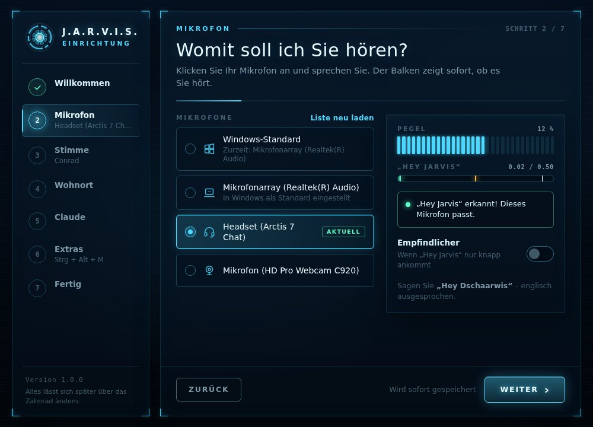
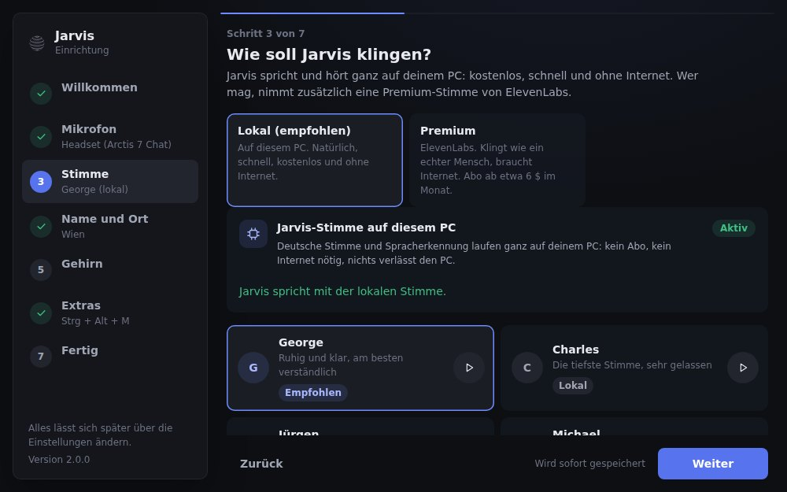

# Jarvis

Dein eigener J.A.R.V.I.S. für Windows: Du sagst „Hey Jarvis“ oder drückst Strg + Alt + J, sprichst deinen Befehl, und Jarvis erledigt ihn auf deinem PC. Er antwortet wie der Butler aus Iron Man, mit einer menschlichen Stimme. Er läuft unsichtbar im Hintergrund, mit einer kleinen Anzeige oben am Bildschirm und einem großen HUD-Fenster auf Wunsch.

**Schnellstart:** [JarvisSetup.exe](https://github.com/georghatzmann-bit/vanity-/releases/latest/download/JarvisSetup.exe) laden, doppelklicken, die Einrichtung durchklicken. Schritt für Schritt in der [ANLEITUNG.md](ANLEITUNG.md).


```
Mikrofon → "Hey Jarvis" (openWakeWord, lokal) oder Strg+Alt+J
         → Satzende per Silero VAD (lokal)
         → Sprache zu Text: Groq Whisper large-v3-turbo (gratis Schlüssel), Ersatz faster-whisper lokal
         → Sofort-Befehle direkt: Programme öffnen/schließen/installieren, Gaming-Modus, Lautstärke, Musik, Uhrzeit
         → alles andere: Claude Code (dein Claude-Pro-Abo), Antwort wird gestreamt
         → Stimme: ElevenLabs (Premium, Streaming), Ersatz Microsoft Neural (gratis), offline Piper
         → Anzeige oben am Bildschirm, HUD-Fenster, Tray-Symbol, Alexa über Home Assistant
```

## Was Jarvis kann

- **Immer da, nie im Weg:** Autostart unsichtbar (nur das Symbol neben der Uhr). Beim Zuhören und Sprechen erscheint oben in der Mitte eine kleine Anzeige, durchklickbar und ohne den Fokus zu stehlen. Bei Vollbild-Spielen und im Gaming-Modus bleibt sie weg.
- **Wie Jarvis aus dem Film:** kurz, ruhig, trockener britischer Humor, kein „Als KI …“, kein „Möchtest du, dass ich …?“. Für dich ist er einfach Jarvis, Claude bleibt unsichtbar.
- **Handelt statt zu fragen:** Programme öffnen, schließen und installieren (winget), Windows einstellen, Dateien ordnen, im Web nachsehen. Nur vor Löschen (Papierkorb), Deinstallieren, Herunterfahren, Senden in deinem Namen und Bezahlen fragt er einmal nach. Administratorrechte holt er sich über die normale Windows-Abfrage.
- **Sofort-Befehle ohne Claude** (unter einer Sekunde): „Öffne Spotify“ (Startmenü-Index), „Schließ Discord“, „Installier mir Steam“ (im Hintergrund, mit Ansage), „Gaming-Modus an“, „Zeig dich“, „Sperr den PC“, „Öffne Downloads“, Lautstärke, Musik, Uhrzeit, Datum, „Stopp“.
- **Gaming-Modus:** Energieplan Höchstleistung, ausgewählte Programme zu, Jarvis selbst mit niedriger Priorität und ohne Einblendungen.
- **Schnell:** Datum und Uhrzeit gehen mit jeder Nachricht an Claude (kein Umweg), `--effort low`, der erste Satz wird gesprochen, während Claude noch schreibt, ElevenLabs beginnt nach 0,25 s Ton zu sprechen.
- **HUD-Fenster:** animierter Kern (Wellen beim Zuhören, Radar beim Nachdenken, Stimm-Kranz beim Sprechen), Untertitel, System-Anzeige, Erinnerungen von heute, Verlauf, Gaming-Schalter.
- **Grafische Einrichtung:** Mikrofon mit Pegel und Hey-Jarvis-Test, Groq-Schlüssel, Premium-Stimmen mit Hörproben (auch deutsche Stimmen aus der ElevenLabs-Bibliothek), Wohnort mit Wetter, Gehirn-Prüfung, Stumm-Taste, Autostart, Alexa.
- **Selbsttest** (`werkzeuge\Selbsttest.bat`) und Protokoll (`logs\jarvis.log`).

| Einrichtung: Mikrofon | Einrichtung: Stimme |
|---|---|
|  |  |

## Kosten

- **Claude-Pro-Abo:** das Gehirn.
- **Groq:** gratis (großzügiges Tageslimit, darüber übernimmt der eigene PC).
- **ElevenLabs:** optional. Gratis-Konto mit 10.000 Credits im Monat und einer selbst entworfenen Stimme (Voice Design). Fertige Stimmen, auch die deutschen aus der Bibliothek, gehen ab Starter (etwa 6 $ im Monat, 30.000 Credits). Ohne Schlüssel spricht die gratis Microsoft-Stimme.

## Anpassen

Das Wichtigste stellst du in der Einrichtung ein. Alles steht in `config.toml` (Vorlage mit Erklärungen: `config.example.toml`):

- `[stt]` `groq_key`, `engine = "auto" | "groq" | "lokal"`
- `[tts]` `engine = "elevenlabs" | "edge" | "windows"`, `elevenlabs_key`, `elevenlabs_voice`, `elevenlabs_model`
- `[mute]` `hotkey` (Stumm), `listen_hotkey` (Zuhören, Standard Strg+Alt+J)
- `[listen]` `silence_seconds` (Wartezeit nach dem letzten Wort), `vad`
- `[gui]` `start_hidden`, `close_to_tray`, `overlay`
- `[brain]` `models`, `effort`, `disallowed_tools`
- `[gaming]` `close_apps`, `power_plan`
- `jarvis_home/CLAUDE.md`: Jarvis' Persönlichkeit und seine Befehle

Ältere `config.toml` werden beim Start einmalig angepasst (`[intern] config_version`).

## Jarvis-Befehle für Claude

```
oeffnen "<name>"   schliessen "<name>"   programme [filter]
installieren "<name|winget-id>"          deinstallieren <id>  (erst nach "Ja")
admin "<PowerShell-Befehl>"              (Windows fragt; Löschen & Co. erst nach "Ja")
papierkorb "<pfad>"                      (erst nach "Ja")
erinnern "in 20 minuten" "Tee"   erinnerungen   erinnerung-loeschen <id>
medien pause|weiter|naechstes|voriges   lautstaerke 30|lauter|leiser|stumm
bildschirm   gaming an|aus   alexa-sagen <raum> "<text>"   smarthome geraete|an|aus|status
```

Zum Ausprobieren im Jarvis-Ordner: `"%LOCALAPPDATA%\Jarvis\venv\Scripts\python.exe" -m jarvis.tool hilfe`

## Sicherheit

- Löschen, Formatieren, Herunterfahren und Deinstallieren sind für Claude direkt gesperrt (`disallowed_tools`). Dafür gibt es `papierkorb` und `deinstallieren`, die erst nach deinem „Ja“ etwas tun. Auch `admin` verlangt bei solchen Befehlen ein „Ja“.
- Ganze Laufwerke, dein Benutzerordner sowie Desktop, Dokumente und Downloads selbst kommen nie in den Papierkorb.
- Die Einrichtung öffnet nur die Anmeldeseiten von ElevenLabs, Groq und Claude.
- Wake Word und Satzende laufen lokal. An Groq geht nur die Aufnahme nach „Hey Jarvis“, an Claude nur der erkannte Text.

## Windows-Details

- Installiert nach `%LOCALAPPDATA%\Programs\Jarvis`, die Python-Umgebung liegt unter `%LOCALAPPDATA%\Jarvis\venv`. Keine Admin-Rechte nötig.
- Start über `pythonw.exe Jarvis.pyw`: kein Konsolenfenster, eigenes Symbol, eigene Taskleisten-Gruppe (`Jarvis.Assistent`). Autostart über `HKCU\...\Run` mit `--hintergrund`.
- Es läuft immer nur ein Jarvis. Ein zweiter Start holt das Fenster des laufenden nach vorn.
- Der Build (`.github/workflows/setup-exe.yml`) installiert die EXE auf einem echten Windows still zur Probe, prüft Startmenü-Suche, die Anzeige, den unsichtbaren Start, den zweiten Start und die Deinstallation, und veröffentlicht sie dann als Release.

## Für Entwickler

```
jarvis/
  __main__.py     Start, Modi (Fenster, Hintergrund, Konsole, Text, Tests), erster Start -> Einrichtung
  assistant.py    Kern: Befehl annehmen, Sofort-Befehle, Claude fragen, sprechen, Gaming-Modus
  brain.py        Claude Code headless mit Streaming, Modell-Fallback, Fehlerarten
  apps.py         Programme: Startmenü-Index, bekannte Apps, winget, Schließen
  voice.py audio.py stt.py   Sprachschleife, Mikrofon, Silero VAD, Groq und faster-whisper
  tts.py elevenlabs.py       Stimme: ElevenLabs-Streaming, Microsoft, Piper, Windows
  overlay.py      Anzeige oben am Bildschirm (Layered Window, Pillow)
  desktop.py      Windows-Einbindung: AppUserModelID, Symbol, zweiter Start
  intents.py tool.py pc.py reminders.py homeassistant.py server.py
  gui/app.py      Fenster (pywebview), Api für die Seite, Ereignis-Brücke
  gui/web/        index.html app.js style.css     HUD-Fenster (Kern als Canvas)
                  setup.html setup.js setup.css   Einrichtung (Api: setup_wizard.SetupApi)
                  Beide Seiten laufen auch im normalen Browser als Demo.
  setup_wizard.py tray.py autostart.py selftest.py simulate.py logsetup.py
jarvis_home/CLAUDE.md   Jarvis' Persönlichkeit
installer/      Inno-Setup-Skript und Windows-Proben für den Build
tests/          python -m unittest discover -s tests
```

Die Tests laufen ohne Mikrofon, ohne echtes Claude und ohne Internet (nachgebautes `claude`, ElevenLabs und Groq).
