# Jarvis

Dein eigener J.A.R.V.I.S. für Windows: Du sagst „Hey Jarvis“ oder drückst Strg + Alt + J, sprichst deinen Befehl, und Jarvis erledigt ihn auf deinem PC. Er antwortet wie der Butler aus Iron Man, mit einer menschlichen Stimme, lernt deine Gewohnheiten und ist auch über Handy und Alexa erreichbar. Er läuft unsichtbar im Hintergrund, mit einer kleinen Anzeige oben am Bildschirm und einem großen HUD-Fenster auf Wunsch.

**Schnellstart:** [JarvisSetup.exe](https://github.com/georghatzmann-bit/vanity-/releases/latest/download/JarvisSetup.exe) laden, doppelklicken, die Einrichtung durchklicken. Klappt auch auf einem leeren PC: Python, Spracherkennung, Stimmen und Claude Code holt der Installer selbst. Schritt für Schritt in der [ANLEITUNG.md](ANLEITUNG.md).

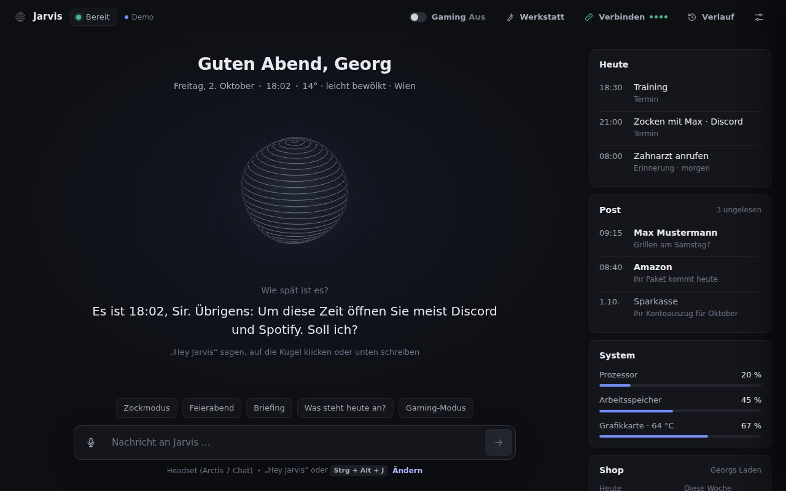

```
Mikrofon → "Hey Jarvis" (openWakeWord, lokal), "Jarvis"/"Hallo Jarvis" (halber Treffer + Prüfung per Spracherkennung, mit Schlüssel über Porcupine), Strg+Alt+J oder im Gespräch einfach weiterreden
Handy    → eigene Web-App im WLAN (QR-Code), Alexa → eigener Skill über ntfy.sh (verschlüsselt)
         → Satzende per Silero VAD (lokal)
         → Sprache zu Text auf dem PC: Parakeet v3 (Ersatz faster-whisper), schon in der Sprechpause vorab erkannt
         → Sofort-Befehle direkt: Programme, Webseiten, Chatnachrichten, Discord ohne Maus, Erinnerungen,
           Termine, Zeitpläne, eigene Befehle, Notizen, Herunterfahren, Licht, Gedächtnis, Werkstatt, Musik
         → Bauaufträge ("Bau mir …"): Werkstatt mit eigenem Claude-Prozess (Opus/Sonnet) und Projektordner
         → alles andere: Claude Code (dein Claude-Abo), läuft dauerhaft, Antwort wird gestreamt,
           mit Fähigkeiten (SKILL.md, nur bei Bedarf gelesen) und Notizbuch (Markdown, Obsidian)
         → Stimme auf dem PC: Thorsten (Piper) oder Pocket TTS, auf Wunsch ElevenLabs. Keine Windows-/Microsoft-Stimme
         → Anzeige oben am Bildschirm, Jarvis-Fenster, Tray-Symbol, Handy-App, Alexa
```

## Was Jarvis kann

- **Immer da, nie im Weg:** Autostart unsichtbar (nur das Symbol neben der Uhr). Beim Weckwort erscheint das Fenster ganz vorn, ohne den Fokus zu stehlen, und verschwindet nach dem Gespräch wieder. Bei Vollbild-Spielen und im Gaming-Modus bleibt es weg.
- **Wie Jarvis aus dem Film:** kurz, ruhig, trockener britischer Humor, kein „Als KI …“. Für dich ist er einfach Jarvis, Claude bleibt unsichtbar.
- **Kommandozentrale:** Das Fenster startet mit deinem Tag auf einen Blick (`zentrale.py`, `zentrale.js`): was Jarvis heute erledigt hat, Kennzahlen (Shop über Shopify, Werbekonten über Windsor.ai, sonst Jarvis' eigener Tag), Tagesplan als Zeitleiste mit roter Jetzt-Linie, Posteingang mit „wichtig“, „offen“, „beantwortet“ und „Werbung“, tagesschau24 live (hls.js, sonst „tagesschau in 100 Sekunden“ oder die Schlagzeile mit Foto) und die Spezialisten mit ihrem Stand. Mails, Termine und Shop holt alle 30 Minuten (bei geschlossenem Fenster alle zwei Stunden) ein eigener Claude-Prozess über deine Konnektoren (`lage.py`, `brain.connector_job`), streng nur lesend: Jede Rückfrage von Claude Code beantwortet Jarvis selbst, senden, entwerfen, markieren, ändern und die Shell sind gesperrt. „Briefing“, „Was steht heute an?“ oder morgens „Guten Morgen“ liest Jarvis sofort vor, ohne auf Claude zu warten, und das Fenster hebt orange hervor, wovon er gerade spricht. Für den wichtigsten Termin stellt er eine Erinnerung eine Viertelstunde vorher.
- **System wie im Video „AgenticOS“:** Der dritte Reiter **System** (oder „Zeig mir das System“) steuert alles aus einem Fenster (`system.py`, `system.js`). Links alle Agents (Jarvis, Recherche, Texte, Technik, Posteingang, Kalender, Shop, Werkstatt, Blueprint, Stream) mit Live-Stand, eigenen Skills und Werkzeugen; ein Klick klappt einen auf, dort geht ein Auftrag direkt an ihn. In der Mitte das **Wissensnetz** (`wissensnetz.py`): Gedächtnis, Personen, Projekte, Recherchen, Notizen, Tage und Sitzungen als lebendiger Graph wie in Obsidian, verbunden über die `[[Links]]`, über Erwähnungen beim Namen und **automatisch** über seltene gemeinsame Begriffe (gestrichelt, mit Grund wie „gemeinsam: Overlay, OBS, Alerts“). Suchen, ziehen, zoomen, Arten ausblenden; ein Klick zeigt Einzelheiten mit allen Verbindungen und „In Obsidian öffnen“. Rechts die Skill-Knöpfe (Morgen-Briefing, Heute planen, Woche planen, Mails prüfen, Tiefenrecherche, Notiz, Weltlage, Spiele-Updates, Stream, PC-Pflege, Letzte Sitzung, Fähigkeit lernen und selbst gelernte), die Automationen (Zeitpläne, eigene Befehle, erkannte Gewohnheiten) und das Gedächtnis **Sitzung für Sitzung**: Nach 20 Minuten Pause beginnt eine neue Sitzung, ihre Themen bleiben dauerhaft, das Gehirn bekommt die letzten mit, und „Was haben wir zuletzt gemacht?“ beantwortet Jarvis ohne Claude. Neue Recherche-Berichte bekommen von selbst „Verwandt: [[…]]“ und einen Eintrag im Tagebuch. „Welche Agents laufen gerade?“ sagt, wer arbeitet.
- **Volle Freigabe:** Jarvis installiert, deinstalliert, räumt in den Papierkorb, führt Administrator-Befehle aus (Windows fragt einmal), fährt herunter und startet neu, ohne nachzufragen. Herunterfahren hat 15 Sekunden Vorlauf, „Stopp“ hält es auf. Nur vor Käufen und vor Nachrichten, deren Inhalt du nicht selbst gesagt hast, fragt er. Abschaltbar in der Einrichtung (`[rechte] volle_freigabe`).
- **Sofort-Befehle ohne Claude** (unter einer Sekunde): „Was kannst du?“, „Öffne Spotify“, „Schließ Discord“, „Installier mir Steam“, „Geh auf Reddit“, „Spiel Thunderstruck“, „Dunkelmodus an“, „Wie wird das Wetter morgen?“, „Was ist 15 mal 23?“, „Fahr den PC herunter“, „Gute Nacht“ (bietet das Herunterfahren an), „Weck mich um 7“, „Mach einen Screenshot“, „Minimiere alles“, „Wie viel Speicher ist frei?“, „Mach das Licht im Wohnzimmer an“, Lautstärke, Musik, Erinnerungen, Timer, mehrere Befehle auf einmal.
- **Discord ohne Maus:** „Schreib Max auf Discord, bin gleich da“, „Geh in den Sprachkanal Zocken“, „Ruf Max auf Discord an“, „Discord stumm“. Jarvis nutzt Discords Schnellsuche und Tastenkürzel, prüft am Fenstertitel, ob er richtig gelandet ist, versucht es bei einer Störung (Maus bewegt, anderes Fenster vorn) von selbst noch zweimal und bringt dich danach zurück ins Spiel. Auch WhatsApp und Telegram.
- **Wählt das passende Gehirn:** Für jede Aufgabe entscheidet Jarvis, welches Claude-Modell und wie viel Nachdenken sie braucht. Kurze Fragen schnell (Sonnet, wenig Nachdenken), Texte und Recherche mittel, Fehlersuche, Code, Analysen und Verträge gründlich (Opus), „maximal“ (Fable) nur auf Wunsch. Nachfragen bleiben auf der Stufe, „Das stimmt nicht“ geht eine Stufe hoch. Umgestellt wird im laufenden Claude-Prozess, ohne Wartezeit. Im Verlauf steht bei jeder Antwort, womit er gedacht hat.
- **Meldet sich von selbst:** ein hängendes Programm (mit Angebot zum Neustart), ein Programm, das im Hintergrund den Prozessor frisst, voller Speicher, Akku, Internet weg, ein neues Programm im Autostart, Windows wartet auf einen Neustart, heiße Grafikkarte. Dazu ein Überblick am Morgen (Wetter, Erinnerungen, Geburtstage, Vorhaben), „Während Sie weg waren …“ und nach drei Stunden eine Pause. Nie beim Zocken, nie mitten ins Gespräch, nie zweimal derselbe Satz (wer redet oder mit dem Controller zockt, gilt als da), „Weiß ich schon“ stellt eine Art für heute ab, „Nie wieder“ für immer.
- **Lernt dich kennen:** „Merk dir, …“, Kontakte mit ihrer App („Sag Max …“), Gewohnheiten auch mit Discord-Sprachkanal, Geburtstage mit Angebot zu gratulieren, jede Nacht ein kurzer Rückblick auf die Gespräche (auch was du vorhattest: „Ich muss morgen noch zur Post“ kommt am nächsten Morgen im Überblick). Vorschläge kommen ohne Fenster, nebenbei am Ende einer normalen Antwort („… Übrigens, Sir: Um diese Zeit öffnen Sie meist Discord und Spotify. Soll ich?“). Alles bleibt lokal (`daten\gedaechtnis.json`) und ist im Fenster einsehbar.
- **Eigene Befehle und Zeitpläne:** „Wenn ich Zockmodus sage, öffne Discord und Steam“, danach reicht ein Wort. „Jeden Morgen um 8 Uhr: Briefing“, „Werktags um 18 Uhr öffne Discord“: Jarvis erledigt es von selbst (beim Zocken wartet er).
- **Termine, Mails und Shop über deine Konnektoren:** Jarvis benutzt die Dienste, die du auf claude.ai verbunden hast (Gmail, Google Kalender, Shopify, Spotify, Canva …): „Was steht heute an?“, „Trag morgen um 18 Uhr Training ein“, „Hab ich neue Mails?“, „Wie läuft der Shop?“. Keine eigenen Anbindungen, keine Passwörter in Jarvis. Claude Code fragt bei jedem Konnektor-Werkzeug nach, Jarvis antwortet selbst: lesen, suchen und eintragen ja, Löschen, Kaufen, Bezahlen und Veröffentlichen nie. Im Fenster unter Verbinden > Konnektoren steht, welche Jarvis sieht.
- **Notizbuch und Fähigkeiten:** jedes Gespräch, Personen, Recherche-Berichte und Notizen als Markdown (in Obsidian verlinkt). Anleitungen für wiederkehrende Aufgaben (Briefing, Recherche, PC-Pflege, Spiele), die Claude nur bei Bedarf liest; „Lern das“ legt neue an.
- **Stimme komplett lokal:** deutsche Stimme und Spracherkennung (Parakeet) ganz auf dem PC, ohne Internet und ohne Abo. Standard ist **Thorsten** (Piper): ein deutscher Sprecher, der nie mitten im Satz abbricht. Die Pocket-TTS-Stimmen (George und andere) sind natürlicher, aber langsamer und bleiben wählbar. Vor dem Sprechen schreibt Jarvis Zahlen, Uhrzeiten, Daten, Kürzel und englische Wörter aus („25.231“ wird „fünfundzwanzigtausendzweihunderteinunddreißig“, „18:30 Uhr“ wird „achtzehn Uhr dreißig“, „Mails“ klingt wie Mails), sonst las die Stimme Kauderwelsch und ließ oft das Satzende weg. Der Installer richtet beides ein, fehlt es, holt Jarvis es im Hintergrund nach. Beim Start wärmt er beides vor, häufige Sätze liegen fertig bereit. Auf schnellen PCs nimmt er von selbst das große deutsche Stimmmodell (im Test 7 bis 10 % falsch verstandene Wörter statt 11 bis 15 %), gemessen einmal pro PC in einem ruhigen Moment. Eine Windows- oder Microsoft-Stimme gibt es nicht mehr.
- **Versteht dich auch, wenn die Erkennung sich verhört:** Programme, Kontakte und eigene Befehle findet Jarvis auch nach Klang („Spottifei“ ist Spotify, „Maks“ ist Max), mit Kölner Phonetik (`klang.py`). Claude weiß, dass gesprochen wurde, und deutet Verhörer nach Zusammenhang.
- **Handy-App:** im WLAN per QR-Code koppeln, dann schreiben, diktieren, Schnellaktionen und die Werkstatt verfolgen. Jarvis antwortet auf dem Handy in seiner eigenen Stimme. Mit Tailscale („Sicher von überall“) auch unterwegs, mit Sprechtaste und als installierbare App. Dazu Wake-on-LAN: den PC per Handy einschalten, und Benachrichtigungen über die App ntfy: Erinnerungen und „Aus der Werkstatt“ kommen aufs Handy, wenn du nicht am PC sitzt.
- **Alexa:** „Alexa, sag Jarvis, er soll Discord öffnen.“ Ein eigener Skill (Von Alexa gehostet), den Jarvis fertig zum Kopieren anbietet. Die Nachrichten laufen verschlüsselt über ntfy.sh, ohne Home Assistant und ohne Router-Einstellungen. Mit Home Assistant zusätzlich Ansagen auf Echos und Licht.
- **Bildschirm lesen und Programme ohne Maus bedienen:** Texterkennung von Windows (in etwa einer Sekunde) und UI Automation: Knöpfe drücken und Felder ausfüllen, ohne Maus und Tastatur zu nehmen.
- **Werkstatt für Programmier-Aufträge:** „Bau mir einen Discord-Bot, der …“ läuft im Hintergrund in einem eigenen Projektordner, mit Plan, Tests, `LIESMICH.txt` und `start.bat`. Getestet wird auf einem unsichtbaren zweiten Windows-Desktop (`versteckt.py`), Testfenster poppen also nicht auf. Große Aufträge mit Opus und viel Nachdenken, kleine mit Sonnet. Während der Arbeit kannst du mit Jarvis reden: Wünsche („Mach den Hintergrund blau“) gehen direkt in die laufende Arbeit, Fragen beantwortet er mit Blick auf den Plan, am Ende fragt er, ob er das Ergebnis starten soll. Das Fenster zeigt die Arbeit als Blaupause: Plan, Ablauf, Dateien, Befehle und das Projekt als Hologramm, das sich von unten aufbaut, erst als passendes Drahtmodell, dann als eigenes Logo, das die Werkstatt zeichnet (`logo.svg`). Dazu alle Projekte als Übersicht mit Logo: Ansehen (Plan, Ablauf, Dateien, Verlauf), Starten, Vorschau, Weiterbauen und Löschen (in den Papierkorb, per Sprache mit Rückfrage). Unten in der Werkstatt ein Feld für Änderungen mitten in der Arbeit.
- **Spiele (Steam, Epic):** „Installiere CS2“, „Starte Lethal Company“, „Welche Spiele brauchen Updates?“ erledigt Jarvis selbst in etwa einer Sekunde (`spiele.py`): Er liest die Steam-Bibliotheken (`libraryfolders.vdf`, `appmanifest_*.acf`) und die Manifeste des Epic-Launchers, kennt Abkürzungen (CS2, GTA 5, R6 …), sucht Unbekanntes im Steam-Shop (und merkt es sich), öffnet `steam://install/<id>`, sagt, auf welchem Laufwerk Platz ist, und meldet, wo der Download wirklich läuft.
- **Weltlage („Gottes Auge“):** „Zeig mir, was in der Welt passiert“ öffnet eine Satelliten-Erde (three.js, Sentinel-2-Bilder von EOX, grobe Karte eingebaut). Jarvis holt die neuesten Meldungen der Tagesschau, findet zu jeder den Ort (`orte.py`, ohne Internet und ohne Claude, darum sofort), fliegt hin und liest vor (`weltlage.py`, `weltlage.js`). Jede Meldung mit Foto (fehlt eins: Satellitenbild vom Ort), die aktuelle groß mit erstem Satz. „Zeig die Erde als Hologramm“ schaltet auf leuchtende Kontinente aus Lichtpunkten mit Lichtsäulen über den Meldungen (ein Shader färbt dieselben Karten und Kacheln um). Dazu „Was passiert in Deutschland“, „Flieg nach Tokio“, „Wo ist die ISS“ (live), Flugverkehr live über OpenSky, DAX, S&P 500 und Bitcoin. Claude kann selbst Orte zeigen (`jarvis.tool weltlage "<Ort>"`).
- **Handsteuerung:** „Starte die Handsteuerung“: Die Webcam erkennt die Hände (MediaPipe, im Fenster, kein Bild verlässt den PC). Greifen und ziehen verschiebt die Erde oder dreht das Blueprint-Modell, mit beiden Händen zoomen und drehen (`handsteuerung.js`).
- **Blueprint: 3D-Modelle wie bei Tony Stark:** „Generiere einen Iron-Man-Helm“ und Claude zeichnet das Modell aus Grundformen Teil für Teil (`blaupause.py`), das Fenster baut es mit three.js als leuchtendes Hologramm über einem Projektor auf, mit Lichtkegel, Funken, Scan-Linie und Leuchten (`blaupause.js`, eigenes Bloom ohne Zusatzdateien). Solange der Blueprint offen ist, redet Georg ohne „Hey Jarvis“ weiter: Jarvis sagt nur „Sofort, Sir.“ und „Erledigt, Sir.“, hört direkt wieder zu und merkt sich Wünsche, während er noch baut (Warteschlange). Drehen, zoomen, verschieben mit Maus, Finger und Sprache, Explosionsansicht mit Beschriftung, Maßlinien in echten Größen, Teile ansehen, färben, entfernen, Rückgängig, umbauen per Sprache („Füg noch zwei Raketen an die Flügel“), speichern und als STL für den 3D-Drucker exportieren. Ansichten: Holo, Echt (mit Spiegelungen), Papier. **Mit Blender:** „Render das“ baut das Modell in Blender nach (echte Materialien, Fotostudio, Cycles auf der Grafikkarte) und zeigt das Foto im Blueprint, „Öffne das in Blender“ legt eine .blend-Datei mit Licht und Kamera an und öffnet sie (`blender.py`, `blender_szene.py`). Fehlt Blender, installiert Jarvis es über winget.
- **Peitsche und Lob** (wie im Video „Response Accelerator“): Braucht Jarvis länger, nimmt man im Fenster die Peitsche, das Seil schwingt mit der Maus (Verlet-Physik, `antreiber.js`), ein Klick knallt, das Fenster zuckt, und Jarvis antwortet schlagfertig. Das wirkt wirklich: Eine Viertelstunde lang wählt er eine Stufe flotter (`modellwahl.Chooser.hurry`, gründlich wird normal, normal wird schnell; was ausdrücklich gründlich sein soll, bleibt es). Die Hand tätschelt mit Herzen und nimmt das zurück. Auch per Sprache: „Schneller!“, „Gut gemacht“.
- **Stream-Modus** (wie im Video „you built Jarvis to run your life“): „Ich will streamen“ oder „Ich streame gleich CS2“ stellt OBS auf die Spiel-Szene (über den WebSocket von OBS, `stream.py` bringt einen kleinen Client ohne Zusatzpaket mit; ist OBS zu, startet Jarvis es mit `--scene`), prüft Mikrofon und Kamera, öffnet das Twitch-Dashboard und nennt ein angesagtes Spiel aus den Steam-Bestsellern, das du noch nicht hast. „Geh live“, „Beende den Stream“, „Zeig mir den Trailer“ (aus dem Steam-Shop, läuft im Jarvis-Fenster mit hls.js), „Wach auf“. Alles ohne Claude, in etwa zwei Sekunden.
- **Gaming-Modus:** Energieplan Höchstleistung, ausgewählte Programme zu, Jarvis selbst mit niedriger Priorität und ohne Einblendungen, keine Vorschläge.
- **Schnell:** In der ersten Sprechpause erkennt Jarvis den Satz schon vorab. Ist es ein Sofort-Befehl („Öffne Spotify“), legt er nach knapp einer halben Sekunde Stille los statt nach einer. Claude läuft dauerhaft im Hintergrund (keine Startzeit pro Frage), der erste Satz wird gesprochen, während Claude noch schreibt. Im Protokoll steht pro Befehl eine Tempo-Zeile.
- **Gespräch ohne Weckwort:** Nach jeder Antwort hört Jarvis 8 Sekunden weiter zu (leiser Ton, Ring um die Kugel). Weiterreden reicht; „Danke“, „Alles klar“, „Tschüss“ oder Stille beenden das Gespräch. „Jarvis“, „Okay Jarvis“ und „Hallo Jarvis“ wecken ihn auch.
- **Drei Ansichten im Fenster:** oben umschalten zwischen **Zentrale**, **Gespräch** und **System**. Das Gespräch ist ein HUD: in der Mitte eine Energie-Kugel mit kreisenden Plasma-Bändern in leuchtenden Ringen (`plasma.js`, ein WebGL-Shader; ohne WebGL die ruhige Linien-Kugel aus `orb.js`), links Menü, was heute ansteht und die aktuelle Aufgabe, rechts der Assistent mit Verstehen, Denken, Erledigen und Sprechen (leuchtet, was gerade läuft), das System und das Gedächtnis. Darunter das Gespräch, Schnellbefehle und das Eingabefeld. Dunkel, eine Akzentfarbe, Orange nur für das, was dich angeht.
- **Installer mit eigenem Fenster:** dieselbe Linienkugel mit Fortschrittsbogen, sechs Schritte mit Häkchen und Restzeit. Holt auf jedem Windows 10 (ab 1809) und 11 alles selbst, ohne Administratorrechte, und sagt bei Problemen klar, was hilft („Nochmal versuchen“, Protokoll).
- **Grafische Einrichtung**, Selbsttest (`werkzeuge\Selbsttest.bat`) und Protokoll (`logs\jarvis.log`).

| Kommandozentrale beim Briefing | Gespräch: Energie-Kugel im HUD |
|---|---|
| 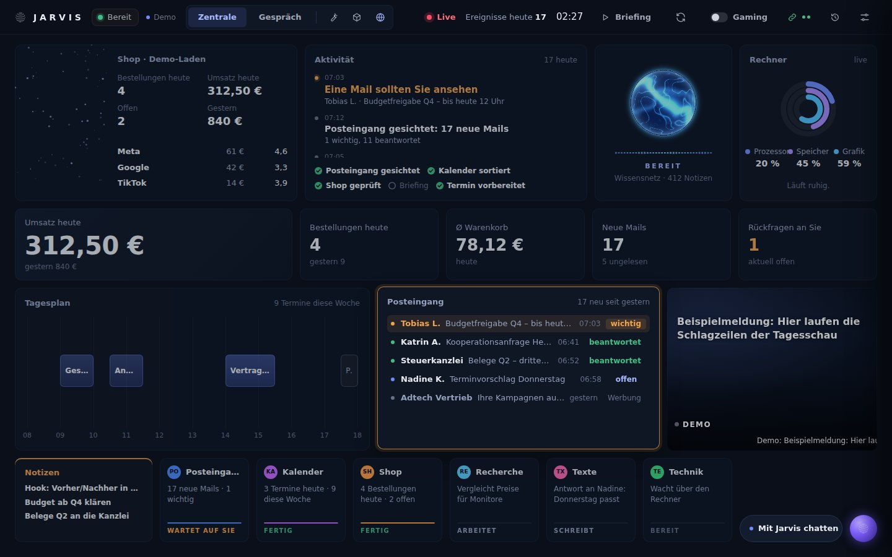 | 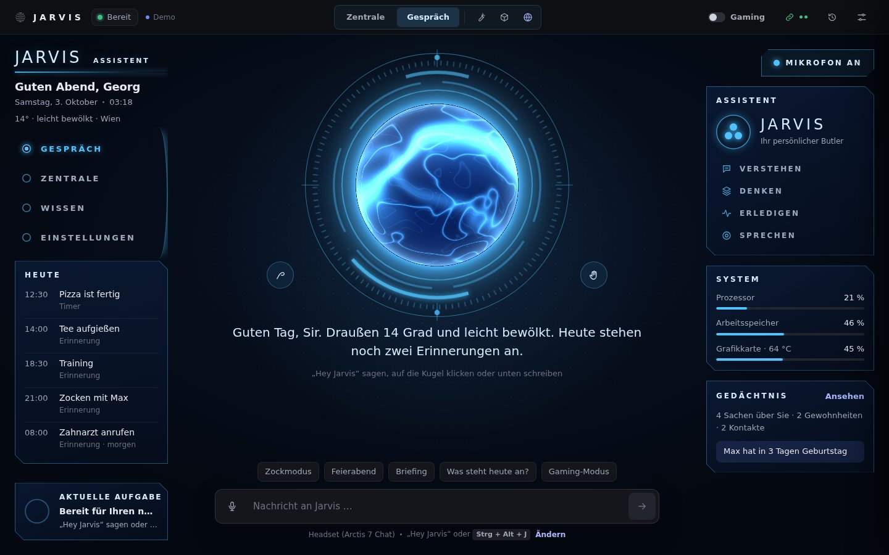 |

| System: Agents, Wissensnetz, Skills, Sitzung für Sitzung |
|---|
|  |

| Werkstatt-Projekte | Handy-App |
|---|---|
| 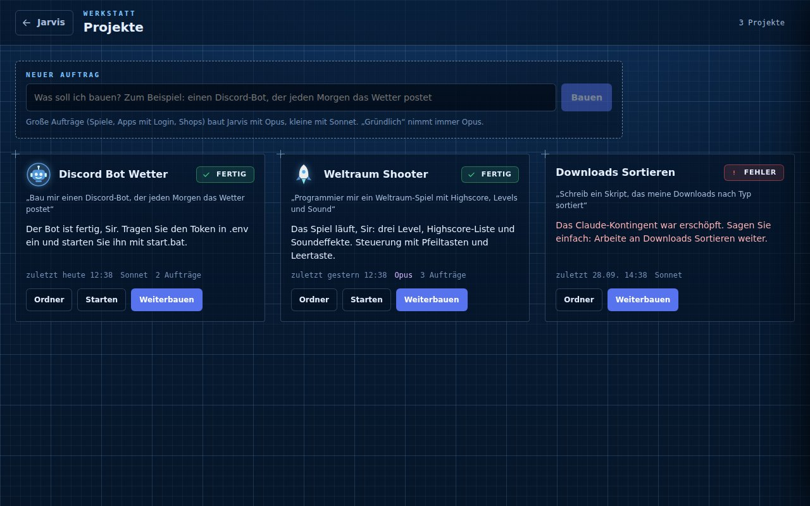 | 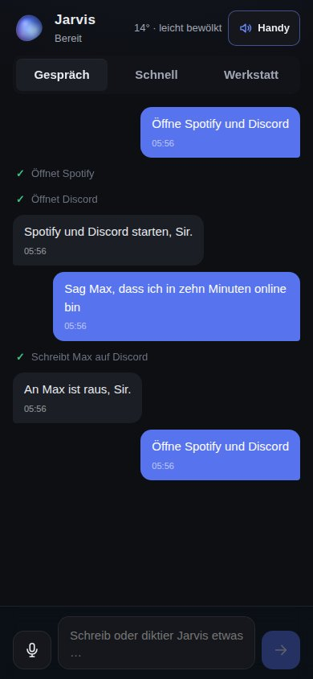 |

| Verbinden | Gedächtnis |
|---|---|
| 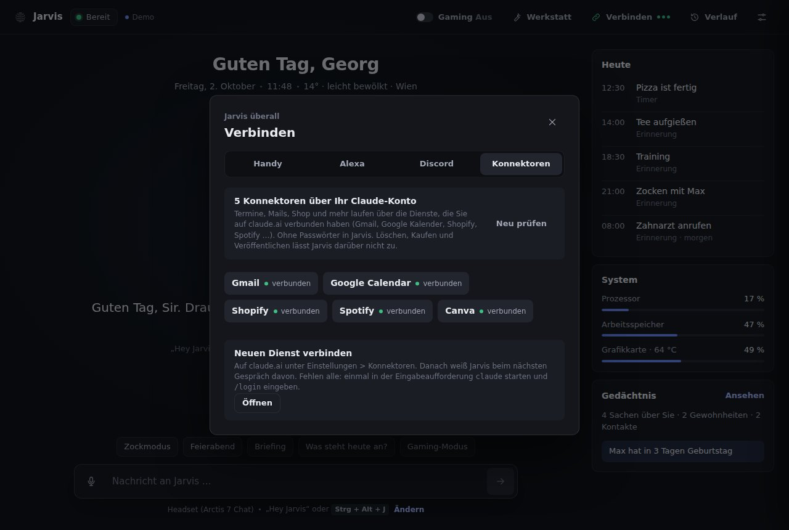 |  |

| Weltlage mit Fotos | Weltlage als Hologramm |
|---|---|
| 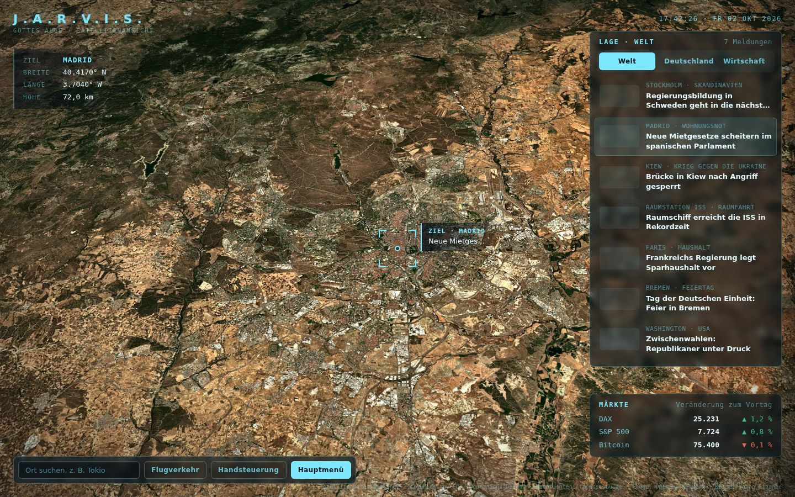 |  |

| Blueprint | Blueprint: Explosionsansicht |
|---|---|
| 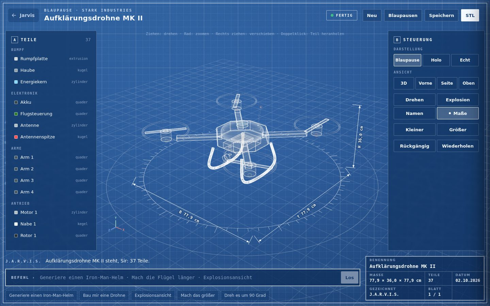 | 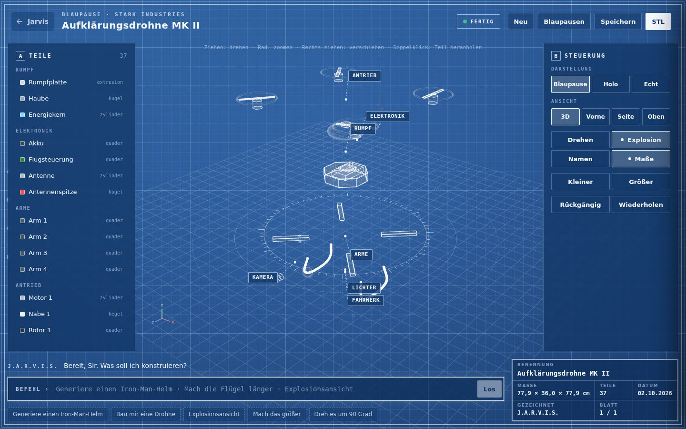 |

| Blueprint: Foto aus Blender („Render das“) |
|---|
|  |

| Installer | Werkstatt |
|---|---|
| 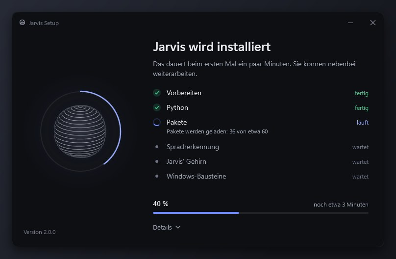 | 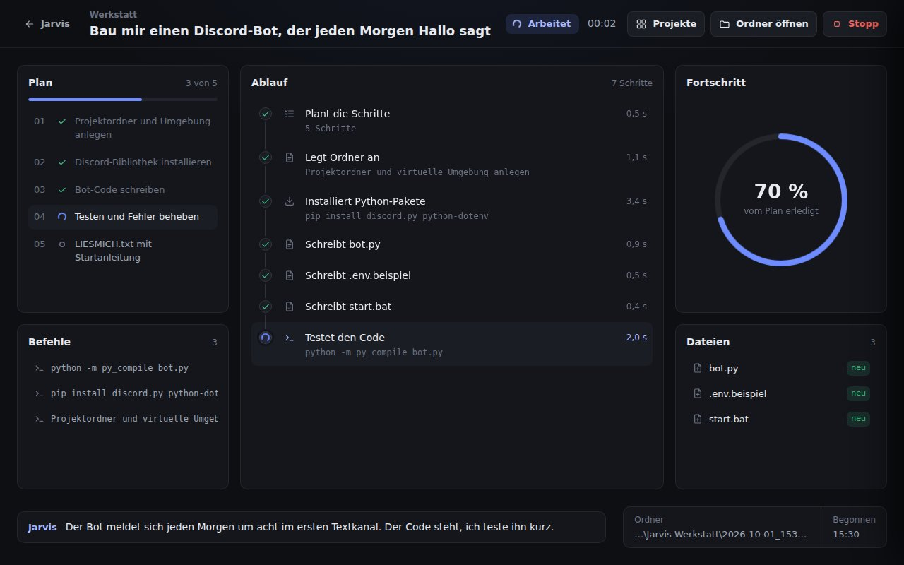 |

## Kosten

- **Claude-Abo (Pro oder Max):** das Gehirn. Jarvis nimmt das große Modell nur, wo es sich lohnt, das schont das Kontingent. Fehlt ein Modell im Abo, nimmt er von selbst das nächstkleinere.
- **Stimme und Spracherkennung:** gratis, ganz auf dem PC (Thorsten/Piper oder Pocket TTS, Parakeet).
- **ElevenLabs:** freiwillig. Gratis-Konto mit 10.000 Credits im Monat und einer selbst entworfenen Stimme. Fertige Stimmen ab Starter (etwa 6 $ im Monat). Fällt ElevenLabs aus, spricht die lokale Stimme.
- **Alexa-Skill, ntfy.sh und Tailscale:** gratis.
- **Weltlage:** gratis, ohne Schlüssel (tagesschau.de, Sentinel-2 cloudless von EOX, OpenSky Network, Yahoo Finance, OpenStreetMap, wheretheiss.at). Ohne Konto erlaubt OpenSky etwa 400 Abfragen am Tag, Jarvis fragt höchstens alle 45 Sekunden.
- **Konnektoren (Gmail, Google Kalender, Shopify …):** kommen mit deinem Claude-Konto, die Dienste selbst kosten, was sie eben kosten.

## Anpassen

Das Wichtigste stellst du in der Einrichtung und im Fenster unter „Verbinden“ ein. Alles steht in `config.toml` (Vorlage mit Erklärungen: `config.example.toml`):

- `[stt]` `engine = "lokal" | "auto" | "groq"`, `lokal_modell`, `groq_key`
- `[tts]` `engine = "lokal" | "elevenlabs"`, `lokal_stimme`, `lokal_qualitaet = "auto" | "beste" | "schnell"`, `elevenlabs_key`, `elevenlabs_voice`
- `[notizbuch]` `ordner`, `tagebuch`
- `[mute]` `hotkey` (Stumm), `listen_hotkey` (Zuhören, Standard Strg+Alt+J)
- `[listen]` `silence_seconds`, `vad`, `gespraech`, `gespraech_sekunden`, `vorab`; `[wakeword]` `picovoice_key`, `name_allein`
- `[rechte]` `volle_freigabe`; `[gedaechtnis]` `vorschlaege`
- `[hinweise]` `aktiv`, `pc`, `internet`, `sicherheit`, `termine`, `morgens`, `zurueck`, `pausen`, `pause_nach_stunden`
- `[gui]` `start_hidden`, `close_to_tray`, `overlay`, `on_wake`
- `[brain]` `modellwahl = "auto" | "schnell" | "normal" | "gruendlich" | "maximal" | "aus"`, `stufe_schnell` … `stufe_maximal` (Modell und Nachdenken je Stufe, z. B. `"opus high"`), `models` (Ersatzreihe), `konnektoren` (claude.ai-Konnektoren an/aus), `disallowed_tools`, `timeout_seconds`
- `[werkstatt]` `ordner`, `modell = "auto" | "opus" | "sonnet"`, `effort`
- `[weltlage]` `aktiv`, `meldungen` (wie viele Jarvis vorliest), `handsteuerung` (Webcam erlaubt)
- `[spiele]` `steam_bestaetigen` (bei nur einer Steam-Bibliothek bestätigt Jarvis den Installieren-Dialog selbst)
- `[server]` Handy-App, `[handy]` Benachrichtigungen (ntfy), `[alexa]` Skill, `[homeassistant]` Echos und Licht
- `[gaming]` `close_apps`, `power_plan`
- `jarvis_home/CLAUDE.md`: Jarvis' Persönlichkeit und seine Befehle

Ältere `config.toml` werden beim Start einmalig angepasst (`[intern] config_version`).

## Jarvis-Befehle für Claude

```
oeffnen "<name>"   schliessen "<name>"   programme [filter]   installieren "<name|winget-id>"
deinstallieren <id>   papierkorb "<pfad>"   admin "<PowerShell-Befehl>"
nachricht <discord|whatsapp|telegram> "<person|#kanal>" "<text>"
discord chat|kanal|server|sprachkanal|anrufen "<name>"   discord stumm|taub
werkstatt "<auftrag>"   werkstatt-weiter "<wunsch>"   werkstatt-projekt "<name>" "<wunsch>"   werkstatt-projekte
blueprint "<wunsch>"   blueprint-aendern "<wunsch>"   weltlage "<ort>"   weltlage-bericht welt|deutschland|wirtschaft
merken "<fakt>"   vergessen "<wörter>"   gedaechtnis
erinnern "in 20 minuten" "Tee"   erinnerungen   erinnerung-loeschen <id>
bildschirm [fenster]   bildschirm-text [fenster]   fenster   ui "<fenster>"   ui-klick   ui-schreiben
herunterfahren|neustarten [sekunden]   energiesparen|ruhezustand|abmelden   herunterfahren-abbrechen
medien pause|weiter|naechstes|voriges   lautstaerke 30|lauter|leiser|stumm   gaming an|aus
alexa-sagen <raum> "<text>"   alexa-befehl <raum> "<text>"   licht an|aus [raum] [prozent]
wol-vorbereiten   wecken <mac>   smarthome geraete|an|aus|status
```

Zum Ausprobieren im Jarvis-Ordner: `"%LOCALAPPDATA%\Jarvis\venv\Scripts\python.exe" -m jarvis.tool hilfe`

## Sicherheit

- Endgültig löschen, formatieren und die Registry ausräumen sind für Claude gesperrt (`disallowed_tools`). Dateien gehen nur in den Papierkorb. Ganze Laufwerke, dein Benutzerordner sowie Desktop, Dokumente und Downloads selbst kommen nie hinein.
- Ohne volle Freigabe tun `papierkorb`, `deinstallieren` und Herunterfahren erst nach deinem „Ja“ etwas. `admin`-Befehle, die endgültig löschen oder formatieren, fragen immer, auch mit voller Freigabe.
- Die Handy-App braucht einen langen Schlüssel (steht im QR-Code), „Neu koppeln“ sperrt alte Handys aus. Der Alexa-Weg ist mit einem eigenen Schlüssel verschlüsselt und signiert, alte oder doppelte Nachrichten werden verworfen.
- Die Handsteuerung nutzt die Webcam nur, solange sie läuft. Das Kamerabild wird im Fenster ausgewertet und nirgends hingeschickt. `[weltlage] handsteuerung = false` schaltet sie ganz ab.
- Weckwort, Satzende, Spracherkennung und Stimme laufen auf dem PC. An Claude geht nur der erkannte Text (an Groq nur, wenn du es ausdrücklich einschaltest). Das Gedächtnis bleibt auf deinem PC.

## Windows-Details

- Installiert nach `%LOCALAPPDATA%\Programs\Jarvis`, die Python-Umgebung liegt unter `%LOCALAPPDATA%\Jarvis\venv`. Fehlt Python, holt der Installer es direkt von python.org (ohne winget, ohne Administrator), ebenso Claude Code, die Microsoft-Laufzeit (ab 14.40) und WebView2. Git for Windows braucht Claude Code seit Version 2.1.120 nicht mehr (dann nimmt es PowerShell).
- `JarvisSetup.exe` ist eine kleine WPF-Oberfläche (.NET Framework 4.7.2, auf Windows 10 ab 1809 und 11 schon da) mit dem Inno-Setup-Kern darin. Den Fortschritt melden der Kern und `werkzeuge\installieren.ps1` als Zeilen wie `JARVIS-SCHRITT 3/6 Pakete`. Mit `/VERYSILENT` läuft sie ohne Oberfläche (alle Inno-Schalter gehen durch), `/vorschau` zeigt die Seiten, ohne etwas zu installieren.
- Start über `pythonw.exe Jarvis.pyw`: kein Konsolenfenster, eigenes Symbol, eigene Taskleisten-Gruppe (`Jarvis.Assistent`). Autostart über `HKCU\...\Run` mit `--hintergrund`.
- Es läuft immer nur ein Jarvis. Ein zweiter Start holt das Fenster des laufenden nach vorn.
- Der Build (`.github/workflows/setup-exe.yml`) macht Bilder aller Installer-Seiten (Artefakt `installer-bilder`), installiert die EXE auf einem frischen Windows still zur Probe, prüft Startmenü-Suche, Anzeige, Texterkennung, Bedienung ohne Maus, unsichtbaren Start, zweiten Start, das echte Fenster in WebView2 (`installer/probe_oberflaeche.py` über den DevTools-Port: keine Skriptfehler, Zentrale mit Daten aus Python, Energie-Kugel mit WebGL, tagesschau24, ein Steam-Trailer per Befehl, das Briefing mit Hervorhebung), ein Update über ein laufendes Jarvis, die Meldung ohne Internet und die Deinstallation. Danach veröffentlicht ein eigener kleiner Job sie als Release.
- Ein Update beendet ein laufendes Jarvis selbst, Einstellungen (`config.toml`) und Gedächtnis (`daten\`) bleiben. Tray-Menü > „Neueste Version laden“ holt die neueste `JarvisSetup.exe`.

## Für Entwickler

```
jarvis/
  __main__.py     Start, Modi (Fenster, Hintergrund, Konsole, Text, Tests), Dienste (Handy, Alexa, Vorschläge)
  assistant.py    Kern: Befehl annehmen, Sofort-Befehle, Claude fragen, sprechen, Gedächtnis, Rechte
  brain.py        Claude Code dauerhaft (stream-json), Modell umstellen ohne Neustart, Fallback, Fehlerarten
  konnektoren.py  Georgs claude.ai-Konnektoren: Rückfragen von Claude beantworten, was Jarvis sieht
  versteckt.py    Unsichtbarer Arbeitsplatz (eigener Windows-Desktop) für die Tests der Werkstatt
  modellwahl.py   Welches Modell und wie viel Nachdenken pro Aufgabe (schnell, normal, gründlich, maximal)
  hinweise.py     Jarvis meldet sich von selbst: Wächter, Messwerte (psutil, Registry, Windows-API), Regeln
  intents.py      Sofort-Befehle erkennen (ohne Claude)
  memory.py       Gedächtnis: Fakten, Kontakte, Gewohnheiten, Vorschläge, nächtlicher Rückblick
  steps.py        Arbeitsschritte: aus Claudes Werkzeugen wird "Installiert Spotify"
  workshop.py     Werkstatt: Bauaufträge im Hintergrund, Wünsche während der Arbeit, Projekte, Opus/Sonnet
  messaging.py keys.py       Chatnachrichten und Discord ohne Maus (Tastatur, Fenstertitel, Wiederholung)
  screen.py       Bildschirmfoto, Texterkennung, UI Automation
  remote.py server.py        Handy-App: Verlauf, Zustand, QR-Code, Web-Eingang
  push.py         Benachrichtigungen aufs Handy (ntfy)
  alexa.py alexa_skill.py    Alexa: Brücke über ntfy.sh und der Skill-Code
  presence.py     Fenster beim Weckwort zeigen und danach wieder verstecken
  apps.py         Programme: Startmenü-Index, bekannte Apps, winget, Schließen
  voice.py audio.py stt.py   Sprachschleife, Vorab-Erkennung, Mikrofon, Silero VAD, Parakeet/Whisper (Groq auf Wunsch)
  tts.py localvoice.py       Stimme auf dem PC (Thorsten/Piper, Pocket TTS), Einrichten im Hintergrund
  aussprache.py              Zahlen, Uhrzeiten, Kürzel und Englisch ausgeschrieben, bevor die Stimme spricht
  elevenlabs.py   Premium-Stimme auf Wunsch
  klang.py        Ähnlich klingende Namen finden (Kölner Phonetik): Programme, Kontakte, eigene Befehle
  zentrale.py lage.py       Kommandozentrale: Aktivität, Kennzahlen, Tagesplan, Briefing; Lagebild über die Konnektoren (nur lesend)
  weltlage.py orte.py       Weltlage: Meldungen mit Ort, Lagebericht, Kurse, Flüge, Raumstation; Ortsverzeichnis
  spiele.py                 Spiele: Steam- und Epic-Bibliotheken, installieren, starten, Updates
  stream.py                 Stream-Modus: OBS-WebSocket (eigener kleiner Client), Twitch, Kamera, Steam-Tipp, Trailer
  blaupause.py              Blueprint: 3D-Modelle aus Grundformen, Befehle per Sprache, Warteschlange, Speichern
  blender.py blender_szene.py   Blueprint in Blender: Foto (Cycles) und .blend-Datei; das zweite läuft in Blender
  overlay.py desktop.py tray.py autostart.py pc.py homeassistant.py persona.py reminders.py tool.py
  gui/app.py      Fenster (pywebview), Api für die Seite, Ereignis-Brücke
  gui/web/        index.html app.js style.css     Jarvis-Fenster; orb.js zeichnet die Kugel (auch Einrichtung und Handy)
                  zentrale.js zentrale.css plasma.js   Kommandozentrale und Gespräch im HUD, die Energie-Kugel (WebGL)
                  antreiber.js               Peitsche und Lob: Seil-Physik, Knall, Hand mit Herzen
                  werkstatt.js projekte.js werkstatt.css   Werkstatt als Blaupause mit Hologramm, Projekt-Übersicht
                  blaupause.js blaupause.css Blueprint: Hologramm mit three.js, Explosionsansicht, STL, Foto aus Blender
                  weltlage.js weltlage.css   Weltlage: Satelliten-Erde oder Hologramm, Meldungen mit Foto, Flugverkehr, Märkte
                  handsteuerung.js           Handsteuerung per Webcam (MediaPipe) für Weltlage und Blueprint
                  koppeln.js gedaechtnis.js       Verbinden (Handy, Alexa, Konnektoren), Gedächtnis
                  setup.html setup.js setup.css   Einrichtung (Api: setup_wizard.SetupApi)
                  handy/          die Handy-App (PWA)
                  Alle Seiten laufen auch im normalen Browser als Demo.
jarvis_home/CLAUDE.md   Jarvis' Persönlichkeit
installer/      Inno-Setup-Kern (jarvis.iss), Bilder und Windows-Proben für den Build
  setup/        die Installer-Oberfläche (WPF, C#): Seiten, Fortschritt, stiller Modus, Vorschau
tests/          python -m unittest discover -s tests
```

Die Tests laufen ohne Mikrofon, ohne echtes Claude und ohne Internet (nachgebautes `claude`, ElevenLabs, Groq und ntfy).
