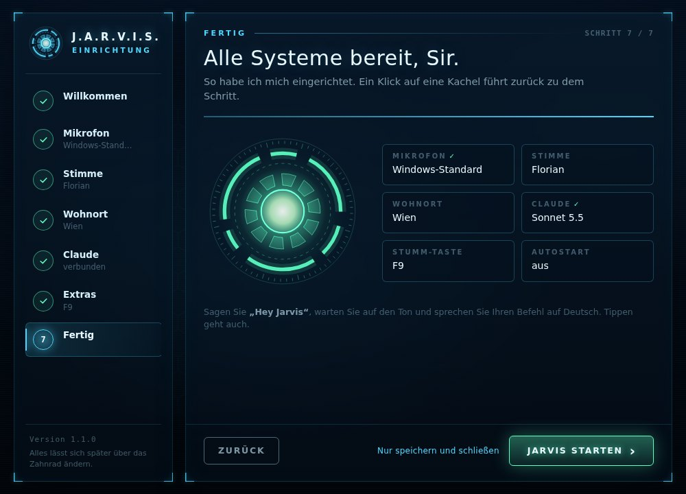

# Jarvis

Dein eigener Sprachassistent wie bei Iron Man: Du sagst "Hey Jarvis", sprichst deinen Befehl, Claude Code erledigt ihn auf deinem PC, und Jarvis antwortet mit einer menschlichen Stimme. Dazu gibt es ein aufgeräumtes Fenster mit Unterhaltung.

**Schnellstart:** [JarvisSetup.exe](https://github.com/georghatzmann-bit/vanity-/releases/latest/download/JarvisSetup.exe) laden, doppelklicken, die Einrichtung durchklicken. Mehr in der [ANLEITUNG.md](ANLEITUNG.md).


```
Mikrofon → "Hey Jarvis" (openWakeWord, lokal)
         → Sprache zu Text (faster-whisper, lokal)
         → schnelle Befehle direkt (Uhrzeit, Lautstärke, Musik, Stopp)
         → alles andere: Claude Code (dein Claude Pro Abo), Antwort wird gestreamt
         → Jarvis-Stimme (Microsoft Neural über edge-tts, gratis), Satz für Satz
         → Jarvis-Fenster, Tray-Icon, Alexa über Home Assistant
```

## Was Jarvis kann

- **Sprache und Tippen:** "Hey Jarvis" plus Befehl, oder auf den Kreis im Fenster klicken (dann hört Jarvis sofort zu), oder rechts unten tippen. Beispiel-Befehle zum Anklicken stehen in der leeren Unterhaltung.
- **Schnelle Antworten:** Jarvis spricht den ersten Satz, während Claude noch am Rest schreibt. Braucht Claude länger, sagt Jarvis "Einen Moment, Sir."
- **Sofort-Befehle ohne Claude:** Uhrzeit, Datum, lauter/leiser, Musik pausieren/weiter/nächstes Lied, "Stopp", "Mikrofon aus", "Neue Unterhaltung".
- **Unterbrechen:** "Hey Jarvis" unterbricht eine laufende Antwort, der Stopp-Knopf, Esc und ein Klick auf den Kreis auch.
- **PC-Aufgaben über Claude:** Programme und Webseiten öffnen, Dateien finden, Websuche, Wetter, Bildschirm vorlesen, Erinnerungen, Gaming-Modus, Morgen-Briefing.
- **Erst fragen:** Löschen (nur in den Papierkorb), Installieren und Nachrichten verschicken macht Jarvis erst nach deinem "Ja".
- **Alexa und Smart Home** über Home Assistant (optional).
- **Jarvis-Fenster** mit Zuständen (bereit, hört zu, denkt nach, spricht, Mikrofon aus), Unterhaltung, Wetter, Uhr, Tray-Icon und Autostart.
- **Grafische Einrichtung** beim ersten Start: Mikrofon mit Pegel und Hey-Jarvis-Test (zeigt, welches Mikrofon Windows als Standard nimmt), Stimmen zum Anhören, Wohnort mit Wetter-Vorschau, Claude-Prüfung mit Installieren/Anmelden-Knopf und Claudes genauer Meldung, Antwort-Tempo, Stumm-Taste, Autostart, Alexa. Jeder Schritt speichert sofort. Später über "Einstellungen" oben rechts.

| Einrichtung: Mikrofon | Einrichtung: fertig |
|---|---|
|  |  |
- **Selbsttest** (`werkzeuge\Selbsttest.bat`) und Logdatei (`logs\jarvis.log`).

## Die Startdateien

Im Alltag brauchst du nur **`Jarvis.bat`** oder das Jarvis-Symbol auf dem Desktop. `Jarvis.bat` installiert beim ersten Mal alles (und nach Updates, wenn sich die Pakete geändert haben), legt das Desktop-Symbol an und öffnet beim allerersten Start die Einrichtung.

Für Sonderfälle liegen im Ordner `werkzeuge`:

| Datei | Was sie macht |
|---|---|
| `Einrichtung.bat` | Einrichtung öffnen (wie "Einstellungen" im Fenster) |
| `Selbsttest.bat` | Prüft alles und sagt, was zu tun ist |
| `Mikrofon-Test.bat` | Mikrofone, Pegel und "Hey Jarvis"-Erkennung live in der Konsole |
| `Claude-Test.bat` | Zeigt, welches Claude-Modell antwortet |
| `Tippen.bat` | Tippen statt sprechen, im Konsolenfenster |
| `Konsole.bat` | Sprachsteuerung ohne Fenster |
| `Neu-installieren.bat` | Alle Pakete frisch installieren |

`Jarvis.bat` versteht auch alle Optionen direkt, zum Beispiel `Jarvis.bat --silent` (nicht vorlesen) oder `Jarvis.bat -v` (alle Details).

## Jarvis reagiert nicht?

Öffne oben rechts die Einstellungen, Schritt Mikrofon (oder `werkzeuge\Mikrofon-Test.bat`). Das zeigt einen Live-Pegel und ob "Hey Jarvis" ankommt:

- **Der Pegel bleibt bei 0:** Windows blockiert das Mikrofon. Öffne *Einstellungen > Datenschutz und Sicherheit > Mikrofon* und schalte "Desktop-Apps den Zugriff auf das Mikrofon erlauben" ein.
- **Der Pegel bewegt sich kaum, wenn du sprichst:** Es ist das falsche Mikrofon. Wähle in der Einrichtung ein anderes.
- **Der Pegel bewegt sich, aber "Hey-Jarvis" bleibt niedrig:** Sprich "Hey Jarvis" englisch aus ("Hey Dschaarwis"). Wenn der beste Wert bei etwa 0.3 bis 0.5 landet, schalte in der Einrichtung "empfindlicher" ein (das setzt `threshold = 0.35`).

Im Konsolenfenster zeigt Jarvis "fast erkannt: 0.38" an, wenn er dich knapp nicht verstanden hat.

## Claude lehnt ab?

Manchmal schlägt Claudes Sicherheitsfilter fälschlich an, sogar bei "hi". Jarvis fängt das so ab:

1. Claude Code startet für Jarvis ohne deine persönlichen Skills, Plugins und CLAUDE.md-Dateien (`isolated = true`), und Jarvis bekommt nur die Werkzeuge, die er braucht.
2. Lehnt ein Modell ab, versucht Jarvis automatisch das nächste aus `models` (Sonnet, Haiku, Opus). Im Fenster steht dann zum Beispiel "sonnet hat abgelehnt, versuche haiku".
3. Lehnen alle ab, versucht Jarvis dieselben Modelle mit einer ganz kurzen Persönlichkeit ("einfacher Modus").
4. Was funktioniert hat, merkt sich Jarvis zwölf Stunden lang, damit die nächste Antwort nicht wieder alle Versuche braucht.
5. Geht gar nichts, sagt Jarvis es auf Deutsch. `werkzeuge\Claude-Test.bat` zeigt dann eine Tabelle, welches Modell mit und ohne deine Einstellungen antwortet.

Auch andere Probleme sagt Jarvis klar an: Pro-Kontingent aufgebraucht, nicht angemeldet, kein Internet, Claude überlastet.

## Anpassen

Das Wichtigste stellst du in der Einrichtung ein. Alles steht in `config.toml` (Vorlage mit Erklärungen: `config.example.toml`):

- **Wohnort** für das Wetter: `ort` unter `[ich]`.
- **Stimme:** `voice` unter `[tts]`, z. B. `de-DE-KillianNeural` oder `de-DE-FlorianMultilingualNeural`. Mit `rate` und `pitch` klingt sie schneller, langsamer, tiefer.
- **Empfindlichkeit:** `threshold` unter `[wakeword]`.
- **Mikrofon:** am einfachsten in der Einrichtung.
- **Stumm-Taste:** `hotkey` unter `[mute]`, z. B. `"f9"`. Jarvis schluckt die Tastenkombination, sie tippt also nichts ins offene Programm.
- **Genauigkeit:** `model = "medium"` unter `[stt]` versteht besser, ist aber langsamer.
- **"Einen Moment, Sir":** `ack_after_seconds` unter `[answer]` (0 = nie).
- **Fenster:** `[gui]`, z. B. `close_to_tray = true`, damit Schließen Jarvis nur ins Tray-Icon versteckt.
- **Gaming-Modus:** `close_apps` unter `[gaming]`.
- **Persönlichkeit:** `jarvis_home/CLAUDE.md` beschreibt, wie Jarvis redet und welche Befehle er kennt.

## Jarvis-Befehle für Claude

Claude steuert die Jarvis-Extras über kleine Befehle, die du auch selbst ausprobieren kannst (im Jarvis-Ordner, `"%LOCALAPPDATA%\Jarvis\venv\Scripts\python.exe" -m jarvis.tool hilfe`):

```
erinnern "in 20 minuten" "Tee"     erinnerungen      erinnerung-loeschen <id>
medien pause|weiter|naechstes|voriges                 lautstaerke lauter|leiser|stumm
bildschirm                          gaming an|aus
papierkorb "<pfad>"                 installieren <winget-id>     (beide erst nach "Ja")
alexa-sagen <raum> "<text>"         alexa-geraete
smarthome geraete|an|aus|status <gerät>
```

## Sicherheit

- Claude darf ohne Nachfrage Programme öffnen, Dateien lesen und schreiben und im Web suchen.
- Löschen, Formatieren, Herunterfahren und direktes Installieren sind unter `disallowed_tools` gesperrt. Stattdessen gibt es `papierkorb` und `installieren`, die erst etwas tun, wenn dein letzter Satz ein "Ja" war.
- Der Web-Eingang für Home Assistant ist aus, bis du ihn mit einem eigenen Token einschaltest.
- Wake Word und Spracherkennung laufen lokal. Nur der erkannte Text geht an Claude.

## Windows-Details

- Die Python-Umgebung liegt unter `%LOCALAPPDATA%\Jarvis\venv`, nicht im Jarvis-Ordner. So lädt OneDrive nicht 1 GB hoch und sperrt beim Installieren keine Dateien.
- Es läuft immer nur ein Jarvis. Ein zweiter Start meldet "Jarvis läuft schon". Nach der Einrichtung wartet der neue Jarvis kurz, bis der alte zu ist.
- Die Installation (`werkzeuge\installieren.ps1`) schreibt alles nach `%LOCALAPPDATA%\Jarvis\installation.log`. Sie legt `Jarvis.lnk` auf dem Desktop und im Startmenü an (minimiert gestartet, damit kein Konsolenfenster aufblitzt).
- Fällt das Mikrofon aus (abgesteckt, Ruhezustand), liest Jarvis die Geräteliste neu ein und versucht es immer wieder. Ist dein Mikrofon weg, nimmt er so lange das Windows-Standardmikrofon.
- Startet Claude ein Programm (etwa Notepad), wartet Jarvis nicht, bis es wieder zu ist.
- Eine alte `config.toml` behält deine Einstellungen. Die Listen `allowed_tools` und `disallowed_tools` werden mit den neuen Vorgaben zusammengelegt, damit neue Sperren auch bei dir greifen.
- Windows-Pfade in `config.toml` in einfache Anführungszeichen setzen: `claude_path = 'C:\Users\Georg\...'`.

## Grenzen

- Eine Antwort von Claude dauert ein paar Sekunden, weil jede Anfrage übers Internet geht. Sofort-Befehle sind sofort da.
- Claude Pro hat ein Nutzungslimit pro 5 Stunden.
- Ohne Internet hört Jarvis zu und erledigt Sofort-Befehle, Claude und die Microsoft-Stimme gehen dann nicht (Jarvis nimmt dann die Windows-Stimme).
- Die echte Filmstimme ist nicht dabei. Conrad klingt aber sehr nach Butler.

## Für Entwickler

```
jarvis/
  __main__.py     Start, Modi (Fenster, Konsole, Text, Tests), erster Start -> Einrichtung
  setup_wizard.py Einrichtung (Python-Seite von gui/web/setup.html)
  assistant.py    Kern: Befehl annehmen, Sofort-Befehle, Claude fragen, sprechen
  brain.py        Claude Code headless mit Streaming, Modell-Fallback, Fehlerarten
  voice.py        Sprachschleife: Wake Word, Aufnahme, Unterbrechen
  audio.py stt.py tts.py text.py   Mikrofon, Whisper, Stimme, Satz-Zerlegung
  intents.py      Sofort-Befehle ohne Claude
  tool.py         python -m jarvis.tool ... (für Claude)
  pc.py reminders.py homeassistant.py server.py   PC-Aktionen, Erinnerungen, Alexa, Web-Eingang
  gui/app.py      Fenster (pywebview), Api für die Seite, Ereignis-Brücke
  gui/web/        base.css                        gemeinsame Farben, Schrift, Knöpfe
                  index.html app.js style.css     Hauptfenster (Kreis als Canvas)
                  setup.html setup.js setup.css   Einrichtung (Api: setup_wizard.SetupApi)
                  Beide Seiten laufen auch im normalen Browser als Demo (ohne Jarvis-Kern).
  tray.py autostart.py selftest.py simulate.py logsetup.py
jarvis_home/CLAUDE.md   Jarvis' Persönlichkeit
tests/                  python -m pytest
```

Die Tests laufen ohne Mikrofon und ohne echtes Claude (`tests/helpers.py` enthält ein nachgebautes `claude`). `simulate.py` spielt die ganze Kette mit erzeugter Sprache durch, das nutzt auch der Selbsttest.
