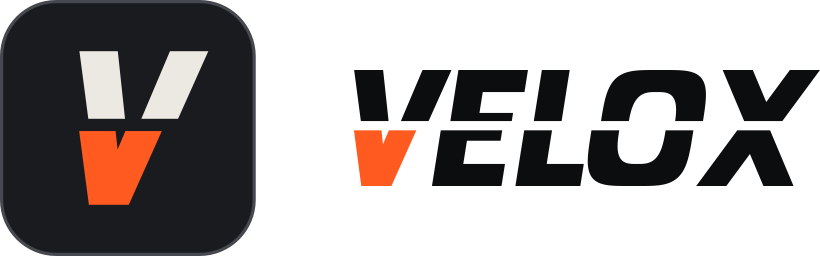

# VELOX – der ultimative PC-Tweaker

VELOX macht Windows 10 und 11 schneller, ruhiger und privater. Hunderte Tweaks, fertige Presets,
eine KI, die deinen PC analysiert, und ein **Detweak**, der die Tweaks anderer Tools sauber
zurücksetzt, bevor VELOX seine eigenen anwendet.

Alles mit Sicherung: Jede Änderung wird vorher gespeichert und lässt sich mit einem Klick
rückgängig machen.

## Starten

1. Den Ordner `velox-tweaker` irgendwo hin entpacken (zum Beispiel auf den Desktop).
2. Doppelklick auf **`Start.bat`**.
3. Die Frage "Möchten Sie zulassen, dass…" mit **Ja** beantworten.
   VELOX braucht Admin-Rechte, weil es Windows-Einstellungen ändert.
4. Ein eigenes Fenster mit der VELOX-Oberfläche geht auf. Das schwarze Konsolen-Fenster
   offen lassen – das ist der Motor im Hintergrund.

Du willst erst mal nur schauen? Doppelklick auf **`Start-Testmodus.bat`**. Im Testmodus
siehst du deinen echten PC, aber VELOX verändert **nichts**.

Falls Windows "Der Computer wurde durch Windows geschützt" zeigt: auf **Weitere Informationen**
und dann **Trotzdem ausführen** klicken. Das kommt bei jeder heruntergeladenen `.bat`-Datei.

## Was VELOX kann

| Bereich | Was passiert |
|---|---|
| **Übersicht** | Dein PC auf einen Blick: Hardware, Score, wichtigste Hinweise. |
| **Tweaks** | Alle Tweaks nach Kategorien, mit Suche, Filter und Erklärung zu jedem Schalter. |
| **Presets** | Fertige Pakete: Sicherer Boost, Gaming Max, Esport, Laptop, Datenschutz, Streamer, FiveM/GTA V, Aufräumen, Ultimate. |
| **KI-Optimierer** | Analysiert deine Hardware und schlägt einen persönlichen Plan vor. Offline kostenlos, oder mit Claude als echter KI (eigener API-Key nötig). |
| **Detweak** | Findet Tweaks von anderen Tools und setzt sie auf Windows-Standard zurück. Danach auf Wunsch direkt ein Preset oder den KI-Plan anwenden. |
| **Spiele** | Erkennt deine Spiele (FiveM, GTA V, Steam, Epic) und gibt ihnen Vorrang bei CPU und Grafikkarte. |
| **Reinigung** | Temp-Dateien, Shader-Caches, Update-Reste und Crash-Dumps löschen. Plus Reparatur-Werkzeuge (SFC, DISM, Netzwerk). |
| **Apps** | Autostart aufräumen und vorinstallierte Bloatware entfernen. |
| **Sicherungen** | Jede Änderung ist protokolliert und lässt sich zurückspielen. |

## Sicherheit

- Vor der ersten Änderung legt VELOX einen **Windows-Wiederherstellungspunkt** an.
- Jeder Schalter zeigt, **wie riskant** er ist: Sicher, Mittel oder Riskant.
- Riskante Tweaks (zum Beispiel Sicherheits-Schutz aus für mehr FPS) sind **nie** in Presets
  und werden nur nach ausdrücklicher Bestätigung angewendet.
- Dinge, die Windows kaputt machen oder dich ungeschützt lassen (Defender aus, Firewall aus,
  Updates komplett aus, Store löschen), sind gar nicht erst eingebaut.
- Die Oberfläche läuft nur lokal auf deinem PC (`127.0.0.1`) und ist mit einem Zufalls-Schlüssel
  geschützt.

## Claude KI (optional)

Im KI-Optimierer kannst du statt der Offline-Analyse **Claude** fragen. Dafür brauchst du einen
eigenen API-Key von [console.anthropic.com](https://console.anthropic.com). Den Key trägst du unter
**Einstellungen** ein; er wird verschlüsselt auf deinem PC gespeichert. An Claude geschickt
werden nur Hardware-Daten und welche Tweaks aktiv sind – keine Namen, keine Dateien.

## Für Entwickler

- Aufbau und Regeln: [`docs/ARCHITECTURE.md`](docs/ARCHITECTURE.md)
- Daten prüfen: `pwsh tools/Validate-Catalog.ps1`
- Backend-Tests: `pwsh tests/Run-Tests.ps1`
- Oberflächen-Tests: `node tests/ui/run-ui-tests.mjs`
