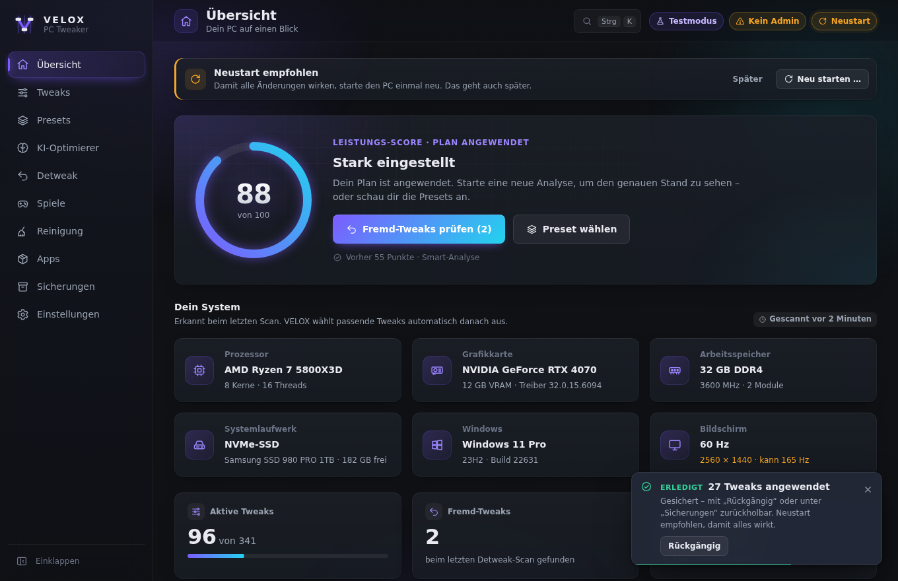
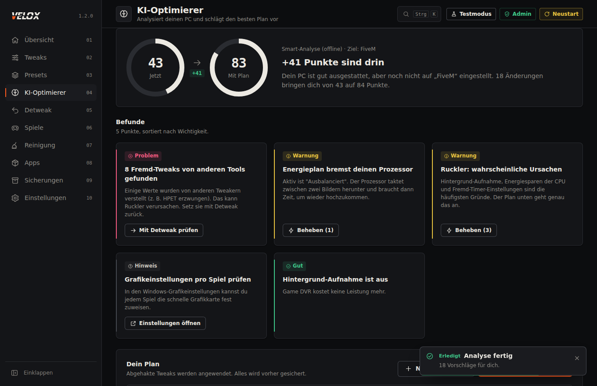
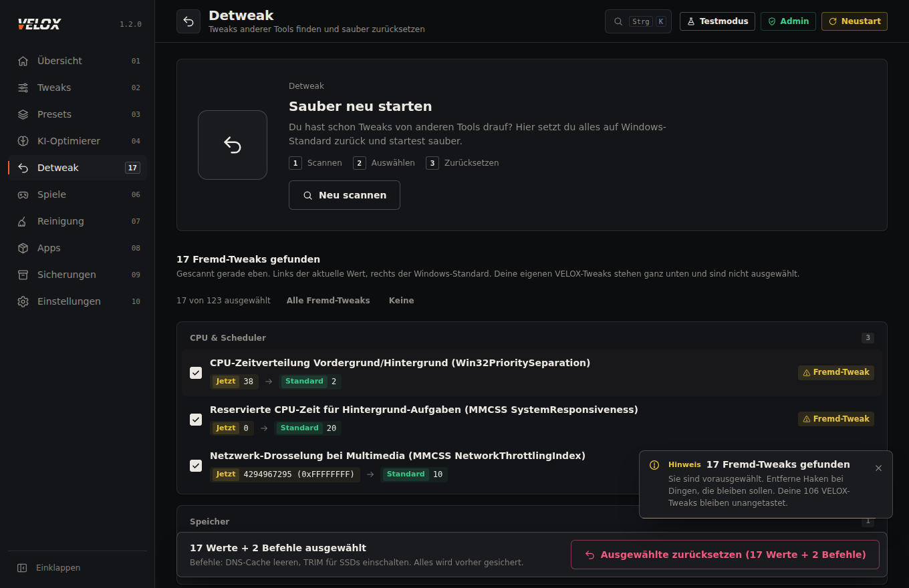
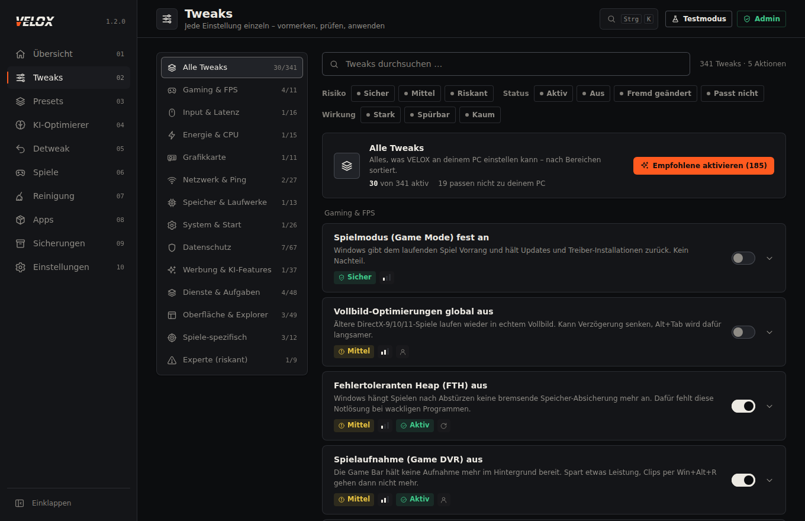

# VELOX – der ultimative PC-Tweaker

VELOX macht Windows 10 und 11 schneller, ruhiger und privater. Hunderte Tweaks, fertige Presets,
eine KI, die deinen PC analysiert, und ein **Detweak**, der die Tweaks anderer Tools sauber
zurücksetzt, bevor VELOX seine eigenen anwendet.

Alles mit Sicherung: Jede Änderung wird vorher gespeichert und lässt sich mit einem Klick
rückgängig machen.

## Starten

1. **`VeloxSetup.exe`** herunterladen – sie liegt im Ordner [`dist/`](dist/VeloxSetup.exe)
   (eine einzige Datei, gut 1 MB).
2. Doppelklick auf `VeloxSetup.exe`. Zeigt Windows „Der Computer wurde durch Windows geschützt“:
   auf **Weitere Informationen** und dann auf **Trotzdem ausführen** klicken. Das kommt, weil das
   Setup nicht digital signiert ist.
3. Die Frage „Möchten Sie zulassen, dass…“ mit **Ja** beantworten und auf **Installieren** klicken.
   Unter **Optionen** kannst du vorher den Ordner und die Verknüpfungen ändern.
4. Fertig. VELOX startest du ab jetzt mit dem **VELOX-Symbol auf dem Desktop** (oder im Startmenü).
   Beim Start fragt Windows wieder nach Admin-Rechten – VELOX braucht sie, weil es
   Windows-Einstellungen ändert.

Du willst erst mal nur schauen? Im Startmenü gibt es **VELOX Testmodus**. Im Testmodus siehst du
deinen echten PC, aber VELOX verändert **nichts**.

Ein Update installierst du genauso: neue `VeloxSetup.exe` starten, **Aktualisieren** klicken.
Deine Einstellungen und Sicherungen bleiben erhalten. Entfernen: Windows-Einstellungen →
Apps → VELOX → Deinstallieren.

### Ohne Installation

1. Den Ordner `velox-tweaker` irgendwo hin entpacken (zum Beispiel auf den Desktop).
2. Doppelklick auf **`Start.bat`** (oder **`Start-Testmodus.bat`** für den Testmodus).
3. Die Frage „Möchten Sie zulassen, dass…“ mit **Ja** beantworten.
4. Ein eigenes Fenster mit der VELOX-Oberfläche geht auf. Das schwarze Konsolen-Fenster
   offen lassen – das ist der Motor im Hintergrund.

Auch hier kann „Der Computer wurde durch Windows geschützt“ kommen: **Weitere Informationen** →
**Trotzdem ausführen**.

## So sieht es aus

| | |
|---|---|
|  |  |
| **Übersicht** – Score, Hardware, nächster Schritt | **KI-Optimierer** – persönlicher Plan mit Begründung |
|  |  |
| **Detweak** – Fremd-Tweaks finden und zurücksetzen | **Tweaks** – 455 Schalter mit Erklärung und Risiko |

## Was VELOX kann

| Bereich | Was passiert |
|---|---|
| **Übersicht** | Dein PC auf einen Blick: Hardware, Score, wichtigste Hinweise. |
| **Tweaks** | 455 Tweaks in 16 Kategorien, mit Suche, Filter und Erklärung zu jedem Schalter. |
| **Presets** | Fertige Pakete: Sicherer Boost, Gaming Max, Esport, Laptop, Datenschutz, Streamer, FiveM/GTA V, Aufräumen, Ultimate. |
| **KI-Optimierer** | Analysiert deine Hardware und schlägt einen persönlichen Plan vor. Offline kostenlos, oder mit echter KI: Claude Code mit deinem Claude-Abo, Claude API oder Groq (gratis). |
| **Detweak** | Findet Tweaks von anderen Tools und setzt sie auf Windows-Standard zurück. Danach auf Wunsch direkt ein Preset oder den KI-Plan anwenden. |
| **Spiele** | Erkennt deine Spiele (FiveM, GTA V, Steam, Epic) und gibt ihnen Vorrang bei CPU und Grafikkarte. |
| **Reinigung** | Temp-Dateien, Shader-Caches, Update-Reste und Crash-Dumps löschen. Plus Reparatur-Werkzeuge (SFC, DISM, Netzwerk). |
| **Apps** | Autostart aufräumen und vorinstallierte Bloatware entfernen. |
| **Sicherungen** | Jede Änderung ist protokolliert und lässt sich zurückspielen. |

## Sicherheit

- Vor der ersten Änderung legt VELOX einen **Windows-Wiederherstellungspunkt** an.
- Jeder Schalter zeigt, **wie riskant** er ist: Sicher, Mittel oder Riskant.
- Riskante Tweaks (zum Beispiel Sicherheits-Schutz aus für mehr FPS) sind **nie** in Presets
  und werden nur nach ausdrücklicher Bestätigung angewendet.
- Dinge, die Windows kaputt machen oder dich ungeschützt lassen (Defender aus, Firewall aus,
  Updates komplett aus, Store löschen), sind gar nicht erst eingebaut.
- Die Oberfläche läuft nur lokal auf deinem PC (`127.0.0.1`) und ist mit einem Zufalls-Schlüssel
  geschützt.

## Echte KI im KI-Optimierer

Der KI-Optimierer kann vier Wege nutzen. Du wählst ihn direkt auf der Seite, eingerichtet wird unter
**Einstellungen → KI**:

| Weg | Was du brauchst | Kosten |
|---|---|---|
| **Claude Code** (empfohlen) | dein Claude-Abo (Pro oder Max) und Claude Code auf dem PC | keine Extrakosten, zählt zu deinem normalen Limit |
| **Claude API** | einen API-Key von [console.anthropic.com](https://console.anthropic.com) | ein paar Cent pro Analyse |
| **Groq** | einen kostenlosen Key von [console.groq.com/keys](https://console.groq.com/keys) | kostenlos, sehr schnell, etwas einfachere Vorschläge |
| **Smart-Analyse** | nichts | kostenlos, offline, in Sekunden |

**Claude Code einrichten:** PowerShell als normaler Benutzer öffnen (nicht als Administrator) und
`irm https://claude.ai/install.ps1 | iex` eingeben. Danach `claude` starten und dich mit deinem
Claude-Konto anmelden. In VELOX auf „Erneut prüfen“ klicken – fertig, ein API-Key ist nicht nötig.
VELOX startet Claude Code ohne Adminrechte, ohne Werkzeuge und ohne Zugriff auf deine Dateien.

Keys werden verschlüsselt auf deinem PC gespeichert. „Verbindung testen“ kostet nichts. An die KI
geschickt werden nur Hardware-Daten und welche Tweaks aktiv sind – keine Namen, keine Dateien.
Jeder Vorschlag wird von VELOX noch einmal geprüft: erfundene, unpassende oder riskante Tweaks
fliegen raus.

## Für Entwickler

- Aufbau und Regeln: [`docs/ARCHITECTURE.md`](docs/ARCHITECTURE.md)
- Daten prüfen: `pwsh tools/Validate-Catalog.ps1`
- Backend-Tests: `pwsh tests/Run-Tests.ps1`
- Oberflächen-Tests: `node tests/ui/run-ui-tests.mjs`
- Setup bauen: `native/build.sh` (Linux/macOS) oder `native/Build.ps1` (Windows), braucht das .NET SDK 8
- Setup-Tests: `node tests/native/run-setup-ui-tests.mjs` und `pwsh tests/native/Test-HostPid.ps1`
